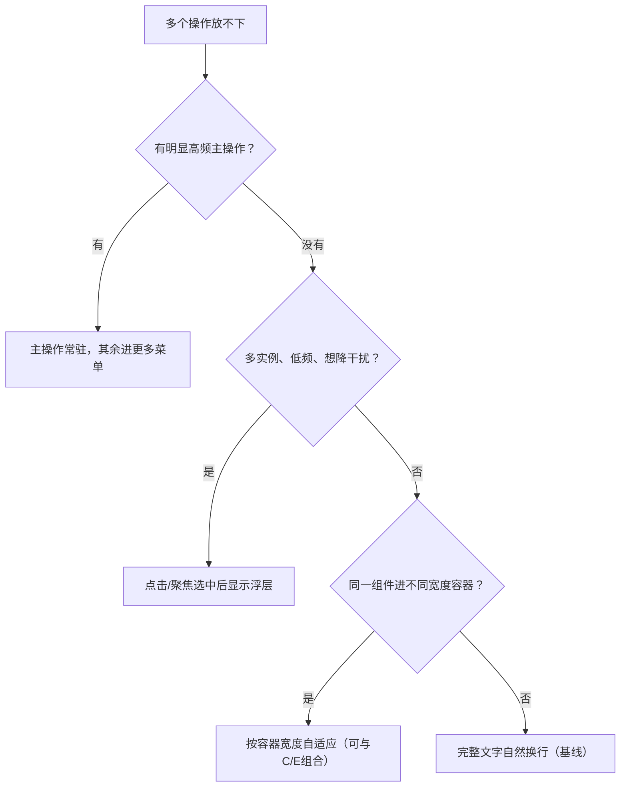

# 策略选型：五种方向

> 何时读：流程步骤 2。先走决策树，再看本表细节。卡片只是示例之一，
决策树适用于任何可复用模块：卡片/列表项/工具栏/表格行/弹窗底部/表单栏/导航项。

## 决策树

## 五种方向对比

| 方案 | 做法 | 优点 | 代价与风险 | 适用判断 |
|---|---|---|---|---|
| 主操作 + 更多菜单（推荐） | 高频常驻，低频进纵向菜单，标签完整 | 主路径明确，窄屏占用小 | 低频多一次打开成本；要做菜单定位关闭焦点 | 主次明确，其余低频/管理性 |
| 选中后浮层（推荐） | 点/聚焦主体后在附近显示工具条 | 列表安静，归属明确，触屏点后可保留 | 要定义选中/切换/收起/遮挡；浮层不能只绑 hover | 多实例低频，想减常驻按钮 |
| 按容器宽度自适应（推荐） | 宽显完整文字，窄切主操作+菜单或换行 | 同组件复用侧栏双列全宽弹窗 | 多一种布局态；断点须实测；宽窄语义顺序一致 | 组件实际宽度明显变化 |
| 固定图标行 | 一行图标按钮，视觉藏文字 | 占用可控，紧凑 | 图标易歧义，增加记忆负担 | 熟悉稳定少量动作，且人人认得 |
| 完整文字换行 | 不截断，整颗换行 | 最易懂，实现低，顺序保留 | 占高增加，密度下降 | 同等重要/无优先级数据/低风险基线 |

## 取舍说明

- 频率相近不许硬点主操作；此时用选中浮层或换行基线。
- 自适应是适配策略，不是独立信息架构：宽窄两态的动作顺序、名称、键盘顺序必须一致。
- 图标化是视觉简化不是语义简化：每个图标按钮都要有与动作一致的程序化名称，切换态同步 `aria-pressed` 与名称（如“加入对比”→“移出对比”）。
- 换行是稳定基线不是设计失败：纵向滚动代价通常小于看不懂、点不到、被截断。
- 一律不用横向滚动、滑动露出、拖拽、长按发现动作；列表与长内容走页面纵向滚动。

## demos 对照与进阶（demo1–3 实测结论）

- demo2 四态对照只做教学，生产默认选菜单：纯图标行省空间但触屏无悬停提示、新用户靠猜（判可选）；
  横滑保留文字但被遮动作需滚动发现、卡内第二滚动轴与纵滑手势歧义（判可选/过渡）；主操作 + 更多主路径明确、文字完整（判默认推荐）。
- demo1 三级收纳（生产完整态）：宽显完整文字 → 中用短标签过渡（如“新标签打开”→“打开”，仅语义无损且实测后用，
  不是必经态）→ 窄切主操作常驻 + 次要进底部动作面板 → 极窄主操作退为图标 + 可访问名。短标签过渡后仍放不下必须进菜单，不许再压字号。
- Priority+ 动态折叠（静态隐藏的进阶，动作数多/文案易变时用）：测每个带文字按钮自然宽 `w_i` + 更多按钮宽 `w_more` + 间距 `G`，
  按优先级算最大可见数 `k`（判据 `W >= sum(B_i)+(N-1)*G`，`W` 为操作区可用宽，文案/字体变化后重算，详见 `js-apis.md`）。
  静态 `@container (max-width:实测值)` 藏次要（demo3 做法）是它的零 JS 近似，动作 ≤4 且优先级稳定时够用。

## 实例映射（任选其一，卡片只是其中一种）

- 工具栏动作 >4：桌面平铺，手机只留主操作+搜索，其余进“更多”，分组一次只开一个浮层。
- 表格行操作：宽表冻结首列或转堆叠列表；窄屏收进每行“更多”菜单，不做行内横滑。
- 弹窗底部：手机变全屏页，按钮纵排或主操作+菜单，不出现双指缩放才能点的按钮。
- 表单提交栏：常驻主提交，次要（存草稿/预览）进菜单或次排；填错不禁用提交，点了定位首错。
