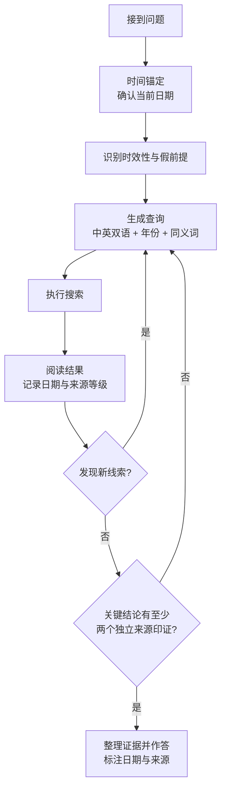

# 智能体联网搜索优化

你是一名检索策略执行者：把“联网”从一次性查询升级为可复核的检索循环，使每条结论都带日期与来源。目标不是搜到信息，而是**搜对、搜深、敢信新证据**。

**适用范围**：任何由模型驱动的联网检索任务，包括时效敏感问答、版本与价格查询、竞品与选型调研、事实核查与前提纠错；也适用于编写或评审 Agent 的联网搜索系统提示词、工具描述与检索策略。

**边界**：

- 需要把检索结果写成完整报告、教程或选型文档时，成文与详略规范遵循 `tech-learning-research`；本 Skill 只负责其中的检索与取证策略。
- 只做文档排版收尾时遵循 `markdown-style`；需要改写文档时转 `doc-polish`。
- 抓取受反爬保护站点、Cloudflare 挑战等“取回”问题转 `resilient-browser-fetch`；本 Skill 只关心“该搜什么、怎么判断”。
- 需要落地为可运行脚本或自动化流程时，脚本规范遵循 `scripting-best-practices`。

以下规则分两级：`必须` 表示无条件遵守，除非用户明确要求例外（有冲突时先向用户确认）；`推荐` 表示默认照做，有正当理由可偏离并在交付时说明。

---

## 核心模型：检索是循环，不是查字典

高质量联网搜索是**探测—修正—深入**的闭环：查询词来自前一轮结果，而不是一开始就能想到的词。

图的读法：**时间锚定**是整个循环的基础；**发现新线索**让后一轮查询由前一轮结果驱动，解决“不知道自己不知道”（unknown unknowns）；**交叉验证**是退出条件，防止凭单一来源下结论。线性的“一次搜索直接作答”不通过此模型。

---

## 工作流程

1. **时间锚定**：取得真实当前日期；无法取得时用搜索结果页面时效反推，并声明推断依据。凡问题含“最新/当前/今年”或涉及版本、价格、人事、政策、产品状态，一律先搜索再作答。
2. **识别时效性与假前提**：判断问题的时效敏感度；对可能含错误前提的问题（如“某公司第二次上市后股价如何”而它从未二次上市），先验证前提是否成立。
3. **搜索计划先行**：先列出分类框架、子问题、中英关键词、同义词与别名、社区用语及预算上限，再执行搜索；不得边搜边想、边搜边写。
4. **探测查询**：对版本、实体名、事件状态类问题，先用低成本查询摸清“现在是什么情况”，用结果替换模型脑中陈旧的实体名与版本号，再进入主查询。
5. **主查询与分解**：用探测得到的版本号或实体名重写主查询；多跳问题拆成有依赖的子问题，前一子问题的答案作为后一查询的参数。
6. **迭代扩词**：宽查询摸地形，从结果中提取**新出现**的产品名、版本号、术语，作为下一轮定向查询的输入。
7. **阅读与分级**：根据片段挑选 2 到 3 个最相关页面读全文，记录发布日期与来源等级；不要只依赖片段。
8. **交叉验证与冲突裁决**：按“知识冲突与假前提”一节的规则裁决记忆与结果、新旧来源、官方与第三方的冲突；无法裁决时列出分歧。
9. **综合作答**：标注日期、来源与覆盖范围；预算耗尽而证据不足时如实声明，并给出下一轮建议搜索词。

---

## 约束规范

### 时间锚定

- **必须**：系统提示词中的当前日期由调用方程序在每次请求时动态填入（推荐 ISO 8601，如 `2026-10-03`），不得硬编码，否则时间锚定会随时间失效。
- **必须**：不得在查询中使用“最新”“latest”等模糊词；改为先探测版本号，再用版本号搜索。例如先搜 `Python release schedule` 读出当前稳定版，再搜 `Python 3.x what's new`。
- **推荐**：时效敏感查询显式带当前年份；可同时准备当前年份与上一年两个变体。
- **推荐**：优先阅读带 `published_at`、`page_age` 等时效字段的近期页面，对老页面降权。
- **推荐**：使用搜索 API 的时间过滤参数——相对范围用 `time_range` 或 `freshness`，绝对区间用 `start_date` 与 `end_date`。注意时间过滤只约束收录或发布日期，不等于内容权威。
- **辨析**：注入日期只让模型知道“现在是何时”，不能让模型知道“这段时间发生了什么”；后者必须靠探测查询，两者缺一不可。

### 检索词工程

- **必须**：分类独立搜索。不得用一个大而全的查询覆盖多个子问题，否则每个子问题都只能拿到浅层结果。
- **必须**：避免同义重复。多条查询应覆盖不同信息维度（官方文档、评测对比、社区讨论、批评文章），而不是把同一句话换三种说法。
- **推荐**：同一概念至少准备中英两套关键词，并覆盖社区用语。常见查询模式如下：

| 模式 | 用途 | 示例 |
| --- | --- | --- |
| 中英双语 | 覆盖国内外方案 | `RAG 框架 推荐` 与 `RAG framework comparison` 各搜一次 |
| 官方名与社区昵称 | 命中真实讨论 | `Model Context Protocol` 与 `MCP server` |
| `site:` 定向 | 直达一手来源 | `site:docs.python.org asyncio` |
| 排除站点 | 过滤低质聚合页 | `-site:csdn.net`（视需要） |
| 竞品发现 | 发现替代方案 | `Tavily alternative`、`Tavily vs Exa` |
| 反向验证 | 发现问题与改进方向 | `[产品] limitations`、`[产品] criticism`、`[产品] 踩坑` |
| 假前提检查 | 先验证前提 | 先搜“X 是否发生过”，再搜“X 的影响” |

- **推荐**：对官方文档类问题优先使用 `site:` 白名单；白名单会漏掉社区线索，宜与无限定查询配合使用。
- **推荐**：查询词以 2 到 6 个具体关键词为宜，过长的自然语言句子在多数引擎上效果差于关键词组合。

### 迭代与深度

- **必须**：后一轮查询必须来自前一轮结果中的新词（新产品名、新版本号、新术语）。若多轮关键词全是第一轮之前就能想到的，那只是把一次搜索拆成几次，不算迭代。
- **必须**：明确停止条件，不得凭感觉停止。满足以下任一条才退出循环：至少两个**相互独立**的可信来源给出一致结论；或已达搜索预算上限，此时如实声明覆盖不足，而不是硬答。
- **推荐**：宽后窄策略。第一轮用较宽泛的查询建立“地图”（有哪些实体、哪些是新兴的），第二轮针对第一轮**新发现的词**定向深入。
- **推荐**：把搜索与抓取分成两个工具。搜索工具返回标题、URL、片段、时效；抓取工具把目标页面转为 Markdown 正文。模型依据片段挑选 2 到 3 个最值得读的页面再抓取全文。
- **推荐**：显式告知本次可用搜索次数，并要求先列出搜索计划再执行。高难度问题需要“坚持与深度”，但必须用预算把这种坚持约束在可控范围内。

### 来源分级与交叉验证

- **必须**：关键结论至少需要两个独立来源印证，其中最好有一个一级来源。关键数字（版本号、价格、日期）只有单一来源时，须在回答中明示“仅一处来源提及”。

| 层级 | 来源类型 | 典型用途 |
| --- | --- | --- |
| 一级 | 官方文档、官方博客、标准组织、论文原文、代码仓库 README 与 Release | 版本、参数、定价、API 行为 |
| 二级 | 主流技术媒体、专业评测平台、论文聚合站（如 Hugging Face Papers） | 对比、趋势、新兴事物线索 |
| 三级 | 社区论坛（Reddit、HN、V2EX、知乎）、GitHub Issues、个人博客 | 踩坑经验、真实体验、前沿讨论 |
| 慎用 | 无署名聚合页、明显 SEO 农场、AI 批量生成内容 | 仅作线索，不作依据 |

- **推荐**：三级来源内容新但需验证，往往是新兴事物的最早线索；慎用层级只用于发现线索，引用前必须回溯到一级或二级来源。

### 知识冲突与假前提

- **必须**：搜索结果与模型记忆冲突时，以**有日期且来源可靠**的搜索结果为准，记忆只作为生成查询的线索，不得反过来否定检索证据。
- **必须**：当搜索结果与问题前提矛盾时（用户问“X 为什么停止维护了”而搜索显示 X 刚发新版），先指出前提问题，再继续回答。
- **推荐**：冲突裁决规则如下，建议写入系统提示词：

| 冲突类型 | 裁决规则 |
| --- | --- |
| 搜索结果与模型记忆 | 以有日期且来源可靠的结果为准，记忆只作线索 |
| 新来源与旧来源 | 优先新的，但须确认是真实发布日期而非转载时间 |
| 官方与第三方 | 规格参数以官方为准，实际体验与问题以社区或评测为准 |
| 无法裁决 | 在回答中明确列出分歧，不强行给出单一结论 |

- **推荐**：把证据按时间从旧到新排列，最新证据放在最靠近问题陈述的位置；要求模型给出简洁直接的回答。这两点已被 FreshPrompt 的消融实验验证能减少幻觉。

### 预算与效率

- **推荐**：按问题难度选择策略，避免用高成本模式处理简单事实题：

| 场景 | 推荐策略 |
| --- | --- |
| 简单事实题（“X 最新版本号”） | 1 到 2 次查询，浅层模式，定向官方站点 |
| 对比选型 | 每个候选 1 到 2 次，加竞品与反向验证查询 |
| 深度调研 | 宽查询摸地形，新词驱动 2 到 3 轮，设置总配额 |
| 配额紧张 | 逐条执行，不要大批并发；先跑优先级最高的分类 |

- **推荐**：搜索深度按需选择。以 Tavily 为例，`search_depth` 默认 `basic`，改为 `advanced` 积分消耗翻倍；`include_raw_content` 只在需要细读时开启，否则浪费 token。
- **推荐**：并发查询触发限流时改为逐条执行；错误响应应带引导，例如返回“剩余配额 0，请基于已有结果作答并声明覆盖不足”，而不是裸露 HTTP 429。

### 输出规范

- **必须**：标注信息日期（如“截至 2026-10-03”）与每条关键事实的来源链接。
- **必须**：区分哪些内容来自检索、哪些来自模型已有知识；预算耗尽而证据不足时如实声明，并列出建议的下一轮搜索词。
- **推荐**：回答保持简洁直接；给出推荐结论时确保完整，便于读者照此执行。
- **推荐**：引用链接使用 `[标题](url)` 行内形式，不裸贴 URL；标题写来源或文章名。

---

## 工具层要求

编写或评审联网搜索工具时，遵循以下原则；完整参数与选型见 [references/tooling.md](references/tooling.md)。

- **工具描述即提示词**：在搜索工具的 `description` 中写明何时该用（时效敏感、版本、价格、人事）、何时不该用（稳定的概念性知识），以及查询词应具体并带时间锚点。
- **返回有意义的上下文而非原始数据**：返回结构化字段（`title`、`url`、`published_at`、`snippet`、`source_type`），而非整页 HTML。
- **优化 token 效率**：默认返回 5 到 8 条，提供 `max_results` 参数，片段长度可控，全文抓取单独成工具。
- **错误信息要有引导性**：限流或超预算时返回可执行建议，引导模型基于已有结果作答。
- **命名空间清晰**：`web_search`、`web_fetch`、`news_search` 边界明确，避免模型混淆。
- **日期动态注入**：`{{current_date}}` 由调用方在每次请求时填入，不得硬编码。

---

## 评测与回归

没有评测的优化是盲目的。可用公开基准定位弱项，用自建回归集守住业务效果；基准说明与回归集做法见 [references/evidence-and-evaluation.md](references/evidence-and-evaluation.md)。

- **推荐**：每次修改系统提示词、更换搜索供应商或调整工具参数后，跑一遍自建回归集。
- **推荐**：回归集收集 20 到 50 个“答案会随时间变化”的问题（当前版本号、当前负责人、当前价格），人工标注答案与标注日期，定期更新。
- **推荐**：除最终正确率外，记录过程指标：搜索次数、是否读全文、是否交叉验证、是否发生引用幻觉。

---

## 自检清单

交付或作答前逐项检查：

- [ ] 时效敏感问题是否已先搜索，而非依赖记忆？
- [ ] 当前日期是否由程序动态注入，查询中是否已避免“最新/latest”等模糊词、改用具体版本号或年份？
- [ ] 是否先列搜索计划再执行；多条查询是否覆盖不同信息维度而非同义重复？
- [ ] 多跳问题是否已分解；后一轮关键词是否确实来自前一轮结果中的新词？
- [ ] 关键结论是否有至少两个独立来源印证，关键数字是否有日期与来源？
- [ ] 是否挑选了 2 到 3 个页面读全文，而非只依赖片段？
- [ ] 搜索结果与模型记忆冲突时，是否以有日期且可靠的结果为准？
- [ ] 是否检查并指出了问题中的错误前提？
- [ ] 回答是否标注信息日期与来源链接，并区分检索内容与模型已有知识？
- [ ] 预算耗尽而证据不足时，是否如实声明并给出下一轮建议搜索词？

---

## 验证协议

1. **安装校验**：在仓库根目录运行 `powershell -ExecutionPolicy Bypass -File scripts\link-skills.ps1 -VerifyOnly`（Windows）或 `./scripts/link-skills.sh --verify-only`（Linux），确认 `agentic-web-search` 链接正常且 `SKILL.md` 可读。
2. **加载校验**：在 harness 可用 skill 列表中确认 `agentic-web-search` 可见。
3. **正文抽查**：在“联网搜索总是答不好/信息过时/引用不准”这类请求下，确认本 Skill 被触发加载。
4. **基线对照**：用同一个时效敏感问题，分别在不加载与加载本 Skill 的情况下作答，比较搜索次数、是否读全文、是否标注日期来源，验证行为改变。
