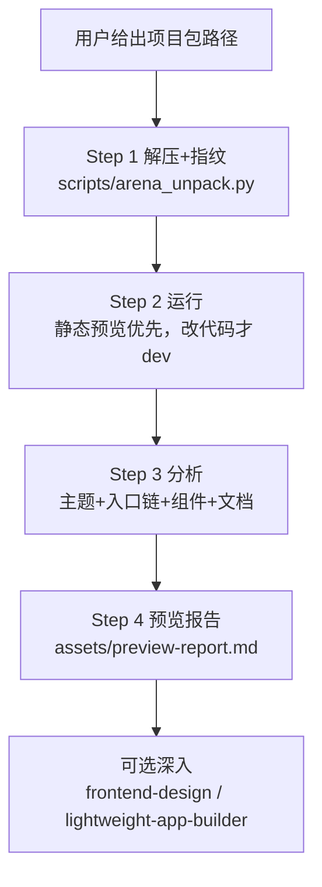

# Arena 项目包预览

把一个刚下载的 arena 交付包变成**跑起来的页面 + 一屏看懂的报告**。顺序不可颠倒：**先解压运行，再分析主题，最后写报告**——没跑起来就分析等于纸上谈兵。

## 适用边界

- 适用：arena.ai code 模式的 `.zip` 项目包；主要是 Web 项目（Vite / Next.js / Vue / 静态页）。
- 非 Web 包（纯文档、脚本、skill 包）：降级只做解压 + 结构分析，不启动运行。
- 不适用：从零新建项目；改包里的 bug（先预览，修 bug 另起任务）。

## 关键认知（先读三行）

这类包是**纯静态前端**：逻辑全在浏览器跑，无服务端代码。`npm run dev` 起的不是应用后端，只是**本地静态文件服务器**（绕过浏览器对 `file://` 下 ES 模块与 fetch 的限制）。所以：

- **只看效果**：优先 `npm run build` + 静态服务预览（`npx serve dist`），甚至导出单 HTML 双击即开。
- **要改代码**：才用 `npm run dev`（热更新）。
- **发给别人**：单 HTML（`vite-plugin-singlefile`）最省事；注意 `public/` 大图不会被内联。

## 工作流



### Step 1 — 解压与指纹

跑 `python scripts/arena_unpack.py <包路径> [--out DIR]`（零依赖，自动剥单层包裹目录、拒绝危险路径）。拿到：项目目录、框架指纹、scripts 表、主题与入口文件定位、建议运行命令。解压目录默认与 zip 同目录的 `<包名>/`，不要解到桌面根；批量对比入口页默认生成在该目录的 `index.html`（带归属标记，非本工具生成的不覆盖）。

### Step 2 — 运行（静态优先）

只看效果走静态链（详见 `references/web-run.md`）：`npm install` → `npm run build` → `npx serve dist`（或 `vite preview`），验 200。改代码才后台起 `dev`。规则：

- 用 background 方式启动，记录**地址 + 停止方法**，两者都必须告诉用户。
- 端口被占就换端口，不要杀用户机器上未知进程。
- 默认**保留运行**（用户要看页面），报告里写清地址和关闭命令。
- `npm install` 失败先看 `references/web-run.md` 故障表，不要反复裸重装。

### Step 3 — 分析

按 `references/theme-analysis.md` 清单执行：入口链（`index.html → main → App → 页面`）、主题 token（字体/主色/背景/圆角，精确到值）、组件与页面清单（分组，标页面级/通用）、文档（README/docs 先读，确认项目是干什么的）。

### Step 4 — 预览报告

用 `assets/preview-report.md` 模板输出，一屏以内：是什么、技术栈表、主题速览、页面清单、运行方式（地址+关闭命令）。报告末尾一句话建议是否值得深入，以及深入方向（UI 评审走 `frontend-design`，工程分析走 `lightweight-app-builder`）。

## 批量对比（同目录多包）

用户要"对比着看"时，不要逐个口头描述，跑脚本生成入口页：

```sh
python scripts/arena_compare.py <目录> [--force] [--no-extract]
```

产出 `<目录>/index.html`：每个项目一张卡片（名称、框架、明暗/规模、主题色条、组件数、运行命令、本地地址链接，行首 `●` 为 dev 端口实时状态）。默认只解压+指纹（轻量，不装依赖）；卡片点进去的前提是各项目已按分配端口启动（5173 起顺延，规则见 `references/web-run.md`）。要并排截图对比时，用 `frontend-design` 的 `screenshot.mjs` 逐个截，拼进同一页看。
用 node 预览服务打开入口页时，卡片升级为动态版：离线 dev 显示灰色"未启动"（不断言可点）；每卡`预览本项`内联 iframe（构建产物优先）；工具条`预览可见项`/`构建可见项`只作用于当前筛选结果（构建逐个串行）。详见 web-learn 侧 README 的"Web 管理台"一节。
卡片行首复选框即批量范围（勾了按勾选来，没勾按可见项）；构建过的卡按钮变"重新构建"，源码新于产物显示"产物过期"（mtime 判定，刷新不丢）。

### 新增包按需解压（`arena_manage.py`）

往已有目录丢新 zip 后，不要直接重跑 `arena_compare.py`（它会把所有包全解了），先扫：

```sh
python scripts/arena_manage.py <目录> [--pick 1,3] [-y] [--json] [--no-rebuild]
```

状态：NEW（新增待选）/ OK（已解压）/ STALE（包更新过，可选重解）/ ORPHAN（无对应 zip，保留不管）/ WARN（同名目录非项目，人工看）。
交互终端列出可选项（序号如 `1,3` / `a` 全选 / 回车跳过）；`--pick` 非交互指定，`-y` 全选 NEW。
解压后默认调 `arena_compare.py --no-extract` 重建入口页：没选的包以"待解压"占位卡片保留（含预留端口），不会被顺手解掉。

## 高频坑位

- **zip 根不是工程根**：有的包多一层包裹目录，脚本自动剥；手工解压时先看顶层再定 `--out`。
- **前台起 dev 堵死会话**：必须 background 启动，前台命令只用于一次性构建验证。
- **端口写死在报告里**：先探活再写地址，`5173` 被占是常态。
- **node_modules 进上下文**：目录树与搜索一律排除 `node_modules/dist/.git`。
- **没跑起来就写报告**：验证 200 是硬门槛，起不来就先修（看故障表），修不好如实写"未跑起来+原因"，不许编页面描述。
- **单文件图片外链**：`public/` 大图不会被 singlefile 内联，要单文件就接受体积或转 base64，否则图片裂开。
