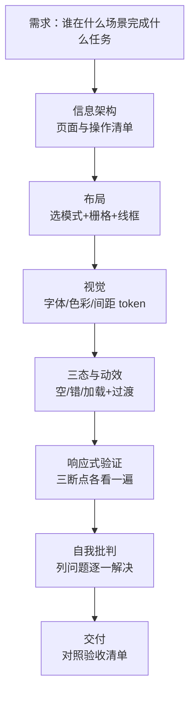

# 轻量前端设计

目标：让小工具的界面**合理、协调、现代、规范**。本 skill 不教你"审美"，只给**可执行的布局规则、可验证的数字、可复用的成熟模式**。

## 适用边界

- 适用：Web 应用 / 本地 Web UI / 桌面 GUI 的前端界面、静态文档页；用 Tailwind/shadcn/Ant Design 等成熟组件库的项目。
- 不适用：品牌 Logo、插画、动效大片、设计系统从零搭建；后端逻辑与工程选型（那是 `lightweight-app-builder` 的职责，两者互补：builder 定"做什么+用什么做"，本 skill 定"长什么样"）。
- 若项目同时从零起步：先用 builder 定形态与技术栈，再用本 skill 定界面。

## 六条设计原则

1. **布局先行，装饰靠后。** 先定栅格、间距、信息层级，再谈颜色动效。布局丑陋换主题救不回来。
2. **渐进式披露。** 首屏只放核心任务；次要操作折叠；高级设置独立成页。详见 `references/progressive-disclosure.md`。
3. **成熟优先，不发明控件。** 按钮、表单、表格、对话框一律用成熟模式（shadcn/Material/Ant Design 的交互约定），用户已有心智模型，不要重新教育。
4. **响应式是必修不是加分。** 三个断点都必须能用，表格与导航必须有降级方案。详见 `references/responsive.md`。
5. **动效克制且有意义。** 只用于状态过渡与等待反馈，有明确时长上限，尊重 `prefers-reduced-motion`。详见 `references/motion.md`。
6. **正式与规范。** 字体、色彩、对比度、中文排版按 token 走，无障碍达标才算做完。详见 `references/visual-tokens.md`。

## 工作流

### Step 1 — 信息架构

列出：页面清单（不超过 7 个一级页面，多的合并）、每个页面的核心任务（只能有一个）、操作清单（分"必须/次要/高级"三档，三档直接对应披露三层）。输出一张表，不要画图。

### Step 2 — 布局

从四种成熟模式里选一种（详见 `references/layout.md`）：仪表盘（侧边+顶栏+卡片网）、表单页（单列窄栏）、列表+详情（主从分栏）、设置页（左导航+右内容）。然后定栅格与间距 scale，输出线框（文字描述或 ASCII 框图均可，禁止直接跳到写 CSS）。线框必须过一遍防挤压与溢出（`min-width: 0`、长串断行、省略策略，见该篇末节）。

### Step 3 — 视觉 token

字体栈、字号 scale、色彩（中性灰阶 + 1 个强调色）、圆角、阴影、间距 scale，一次定完写进 CSS 变量/主题文件。禁止散落的魔法数字（页面里不许出现 `margin: 13px` 这种值）。可读性按 `references/visual-tokens.md` 可读性节验收（行长、三档文字、链接样式）。

### Step 4 — 三态与动效

每个异步操作、每个列表、每个表单提交，必须有**空状态 / 错误状态 / 加载状态**三件套；过渡与加载按 `references/motion.md` 的时长规则配。

### Step 5 — 响应式验证

在三个断点各截一屏（或描述）：<640、640–1024、>1024。检查清单：无横向滚动、导航可达、表格有降级、触控目标达标。能起浏览器时用 `scripts/screenshot.mjs` 自动截三断点再人工看一遍。

### Step 6 — 自我批判与交付

先做一轮自我批判：换新用户 / 窄屏 / 键盘三种视角列出可能的问题，逐一解决，解决不掉的写入已知问题清单。再对照 `assets/design-review-checklist.md` 逐项打勾，未全过不得交付。

## 全局硬数字（速查）

| 项 | 规范 | 出处 |
| --- | --- | --- |
| 间距 | 4pt 基准，只用 4/8/12/16/24/32/48 | `references/layout.md` |
| 正文 | 14–16px，中文行高 1.6–1.7 | `references/visual-tokens.md` |
| 行长 | 中文每行 28–40 字，英文 45–75 字符 | `references/visual-tokens.md` |
| 对比度 | 正文 ≥4.5:1，大文字 ≥3:1 | `references/visual-tokens.md` |
| 断点 | 640 / 1024 两刀三段 | `references/responsive.md` |
| 触控目标 | ≥44×44px；桌面按钮高 ≥32px | `references/responsive.md` |
| 过渡时长 | 150–250ms ease-out，页面切换 ≤300ms | `references/motion.md` |
| 加载策略 | <300ms 免动画；300ms–2s 转圈；>2s 骨架屏+可取消 | `references/motion.md` |
| 首屏主操作 | ≤3 个 | `references/progressive-disclosure.md` |
| 一级页面 | ≤7 个 | Step 1 |

## 参考文档路由表

按需一次读一篇。

| 何时读 | 读哪篇 |
| --- | --- |
| 定栅格、间距、对齐、选布局模式、防挤压溢出 | `references/layout.md` |
| 首屏放什么、折叠什么、设置页怎么组织 | `references/progressive-disclosure.md` |
| 断点、表格降级、导航折叠、触控目标 | `references/responsive.md` |
| 过渡、加载、骨架屏、时长与 easing | `references/motion.md` |
| 字体、色彩、圆角、阴影、中文排版、可读性、无障碍 | `references/visual-tokens.md` |
| 交付前验收（含自我批判与溢出专项） | `assets/design-review-checklist.md` |
| 自动截三断点整页截图 | `scripts/screenshot.mjs` |

## 高频坑位

- **先写 CSS 后定布局**：返工头号来源。线框确认前不许碰视觉 token。
- **自创控件**：自制日期选择/下拉/开关看似省事，键盘、触控、无障碍全要自己补，总成本更高。
- **只在桌面宽度验收**：窄屏翻车（表格撑破、按钮挤出）占 UI bug 一半以上，三断点必须各看。
- **加载只有转圈**：超过 2 秒的等待没有进度与取消，用户会反复点击导致重复提交。
- **动效无开关**：系统开减少动态的用户会被迫看动画，必须跟随 `prefers-reduced-motion`。
- **中文用英文行高**：1.2–1.4 的行高给中文就是糊成一片，中文正文一律 1.6 起。
- **颜色传达唯一信息**：红字报错对色盲用户不可见，错误必须配图标+文字。
- **页面级横向滚动**：flex 子项缺 `min-width: 0`、长串不断行是两大元凶，见 `references/layout.md` 防溢出节。
- **只看代码不看截图**：溢出、截断、重叠看代码看不出来，三断点截图必须人工过一遍。
