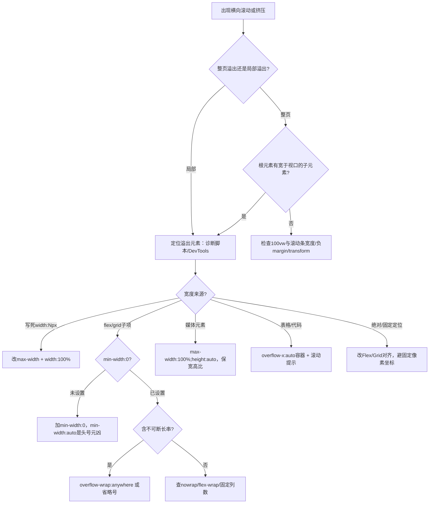
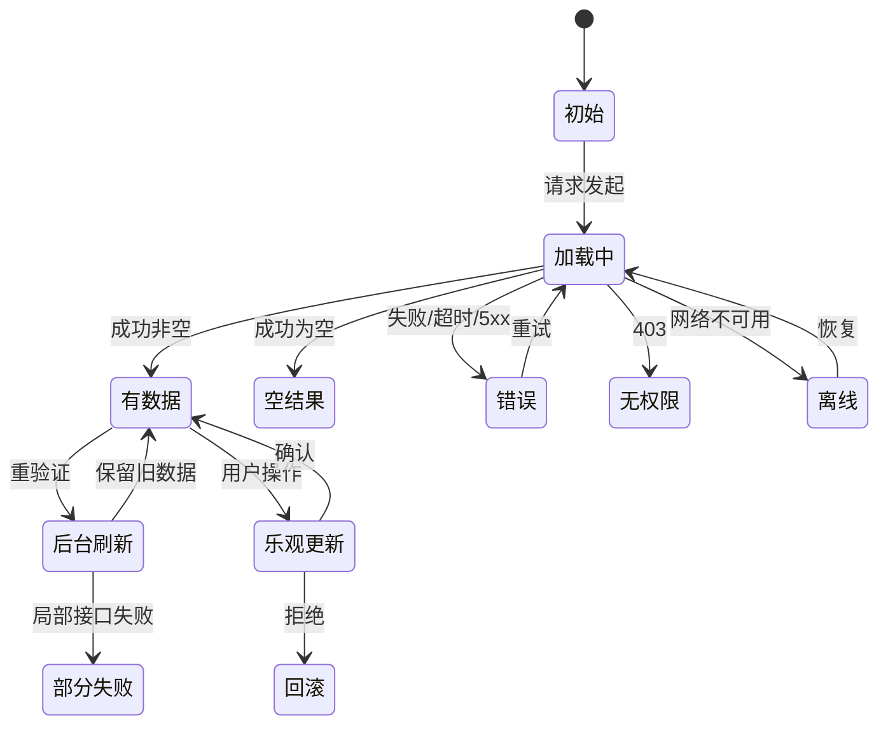
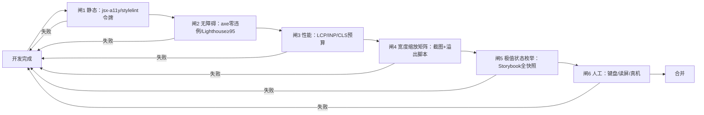

# 前端设计 UI/UX 中常见的不良设计和问题盘点（合并版）

> 合并来源：`前端设计ui(ux)中常见的不良设计和问题盘点fable.md`（叙事型，感知链路 8 章，`product-grid` 健壮示例见长）
> + `前端设计ui(ux)中常见的不良设计和问题盘点opus.md`（清单型，`L/C/S/V/A/F/N/I/D/P/G` 编号体系，可执行脚本见长）。
> 合并原则：**以 opus 编号体系为骨（可追溯、可进 CI/`AGENTS.md`），以 fable 示例与辨析为血肉**。fable 的 `L1/A1/M1/P1/C1/D1` 旧编号全部废弃，统一映射到新编号；阈值冲突以联网核实为准。

## 信息获取情况与来源声明

| 分类 | 是否联网核实 | 说明 |
|---|---|---|
| 响应式失效根因、WCAG Reflow/文本间距、Core Web Vitals 阈值、WebAIM Million、无障碍统计 | 是 | 见文末来源；本次合并前复核（2026-10-01）：CWV 阈值未变（`LCP≤2.5s / INP≤200ms / CLS≤0.1`），“CLS 收紧到 0.08”无官方依据，不采用；WebAIM 2025 数据两稿一致可信（`50,960,288 / 均值51/页 / 同比-10.3%`）；WCAG 2.2 `2.5.8 24×24 / 2.4.11 Focus Not Obscured` 与 W3C 原文一致 |
| 表单 Baymard 实证、CLS 成因（2025 Web Almanac 转引）、AI 生成界面缺陷特征 | 是（opus 轮） | Baymard 16 年结算研究、standardbeagle 2025 回顾、UX Planet `DESIGN.md` 文章；转引数据已标注 |
| 表单细节、暗黑模式具体数值（`#121212` 等）、动效时长区间、微信/国产内核行为、`text-autospace` 等 CSS 兼容性 | 否（训练知识/经验共识） | 视为经验值而非实证，使用前以 caniuse/MDN 实测为准；深色模式色值仅为起点 |
| WebAIM 2026 报告 | 部分 | 2026 报告已发布（约 56.1/页，回升 ~10%）；正文仍以 2025 为基准，新报告仅作趋势注记 |

本话题属于相对稳定的知识领域，核心规范（WCAG、CWV、Nielsen 启发式）已核实，可展开正文。未核实部分已逐节标注。

## 阅读指引与缺陷分类框架

本文按**用户感知链路**组织（fable 视角）：能不能看到完整内容（L/C）→ 页面稳不稳快不快（V）→ 知不知道系统在干什么（S）→ 能不能顺利操作（F/N/I）→ 所有人是否都能用（A/P）→ 是否尊重用户（H）→ AI 产物如何约束（G/D）。

每条缺陷统一四要素：**现象、根因、复现、验收**，编号可直接写入 Issue/`AGENTS.md`。

| 前缀 | 类别 | 核心关注 | 可自动化程度 |
|---|---|---|---|
| `L` | 布局与响应式 | 宽度变化下的溢出、挤压、堆积 | 中（溢出脚本） |
| `C` | 内容鲁棒性 | 极端长度、空值、多语言、极值 | 低（需构造数据） |
| `S` | 状态覆盖 | 加载/空/错误/离线/权限/部分失败 | 低（需 Storybook 枚举） |
| `V` | 视觉稳定与体感 | CLS、INP、滚动卡顿 | 高（Lighthouse/RUM） |
| `A` | 无障碍 | 对比度、语义、键盘、焦点 | 高（axe-core） |
| `F` | 表单与录入 | 校验、标签、自动填充、提交 | 中 |
| `N` | 导航与状态同步 | URL、后退、滚动恢复 | 中（E2E） |
| `I` | 交互反馈与动效 | 反馈时延、动画、误触 | 低 |
| `D` | 视觉与审美（含深色模式） | 层级、间距、色彩 | 中（视觉回归） |
| `P` | 跨平台与环境差异 | 浏览器/OS/缩放/滚动条/IME/国内环境 | 低（需真机矩阵） |
| `G` | AI 生成代码特有缺陷 | 同质化、脆弱交互、规范失效 | 中 |
| `H` | 诚实设计 | 欺骗性模式 | 低（人工评审） |

核心判断：**左上象限（自动化可查且影响大）最不可原谅**——表单无标签、低对比、无尺寸图片、焦点环被删，axe-core+Lighthouse 几秒可查，却是全网违例率最高项，应先进 CI 闸门。

---

## 类别 L：布局与响应式崩坏（最高频）

问题现象（fable 归纳）：拖窄窗口出现横向滚动条/内容被裁；中等宽度下多列既不换行也不缩小，文字压成竖排、按钮折行、图标错位；绝对定位/固定高度元素压住下方内容；超宽屏（2560px+）行长超 100 字符；200%~400% 缩放下布局崩塌或需二维滚动。

核心原理：响应式失效是因为布局中**某个部分拒绝收缩、换行、堆叠或尊重视口**。刚性来源：写死宽度的容器、永不换行的 flex 行、过宽子元素、缺失视口设置、触发太晚的断点。真正的修复是找到**强迫小屏执行桌面行为的刚性元素**，而不是再加一个媒体查询。判断信号：**只要看到横向滚动条，哪怕一点点，就说明有东西溢出**。



### 健壮示例：商品卡片网格（fable 示例，并入 L-07/L-08）

场景：电商后台商品网格，商品名中英混排、图片尺寸不一、窗口任意拖动。

```css
.product-grid {
  display: grid;
  grid-template-columns: repeat(auto-fill, minmax(min(100%, 240px), 1fr));
  gap: clamp(0.75rem, 2vw, 1.5rem);
}
.product-card { min-width: 0; display: flex; flex-direction: column; }
.product-card img {
  max-width: 100%; height: auto; aspect-ratio: 4 / 3; object-fit: cover;
}
.product-title {
  overflow-wrap: anywhere;
  display: -webkit-box; -webkit-line-clamp: 2;
  -webkit-box-orient: vertical; overflow: hidden;
}
.page {
  max-width: 80rem; margin-inline: auto;
  padding-inline: clamp(1rem, 4vw, 3rem);
}
```

| 字段 | 含义 | 辨析 |
|---|---|---|
| `repeat(auto-fill, minmax(min(100%,240px),1fr))` | 列数自动计算；`min(100%,240px)`防窄容器溢出 | `auto-fill`保留空轨道（卡片宽度稳），`auto-fit`折叠空轨道（拉伸现有项） |
| `min-width: 0` | 解除 flex/grid 子项 `auto` 最小尺寸，允许收缩 | 纵向对应 `min-height: 0` |
| `overflow-wrap: anywhere` | 必要时任意断行，且参与 min-content 计算 | `break-word`不参与 min-content，flex/grid 中仍可能溢出；`break-all`粗暴切单词，仅适合代码/哈希 |
| `aspect-ratio` | 未加载图片预留比例，防 CLS | 等效于写 `width/height` 属性，更适配流式宽度 |
| `-webkit-line-clamp: 2` | 多行省略 | 须配 `display:-webkit-box` + `-webkit-box-orient:vertical`；单行用 `nowrap+hidden+ellipsis` 三件套 |
| `clamp()` | 流体值下限/首选（含 vw）/上限 | 字号用纯 vw 会导致浏览器缩放失效，慎用 |
| `margin-inline` | 逻辑属性 | RTL 自动翻转，优于 left/right |

### L 类缺陷明细

**`L-01` 固定宽度容器**：现象为变窄出现横向滚动。根因为 `width:1200px` 而非 `max-width`。复现：2560px→320px 连续拖动。验收：`width:\s*\d{3,}px` 全站检索，布局容器一律 `width:100%; max-width:<N>px; margin-inline:auto`。

**`L-02` `min-width:auto` 陷阱（最隐蔽最高频）**：现象为给了 `overflow:hidden/ellipsis` 仍撑破父容器。根因：flex/grid 子项 `min-width` 初始值是 `auto`（约等于最长单词/最宽列），`1fr` 实为 `minmax(auto,1fr)`。修复：`min-width:0`（或 `min-inline-size:0`），grid 用 `minmax(0,1fr)`，纵向用 `min-height:0`。验收：含超长文本的子项必须显式声明。

**`L-03` 不可断长串溢出**：长 URL/路径/Base64/无空格英文标识符撑破容器。中文纯文本可在字间断行很少溢出，风险在**中英混排与长串数字/代码**。不要全局 `word-break:break-all`。修复：`.prose{overflow-wrap:anywhere; word-break:normal; line-break:strict;}`。验收：120 字符无空格 URL + 中英混排注入标题/标签/按钮/单元格/面包屑/tooltip 后做宽度扫描。

**`L-04` 媒体元素未约束**：用户上传大图/iframe 撑破布局。基线写入 `reset.css`：`img,video,canvas,svg,iframe{max-width:100%} + img,video{height:auto}`（注意勿加 `width:auto`，见 L-05）。验收：4000×3000 图 + 16:9 iframe 注入各内容区扫描。

**`L-05` 全局 `width:auto` 抵消宽高比（与 CLS 耦合）**：HTML 写对尺寸仍偏移，元凶是 `img{width:auto;height:auto;max-width:100%}`。保留 `height:auto`，**不要写 `width:auto`**。验收：DevTools 确认首屏图有有效 `aspect-ratio`；Lighthouse 图片尺寸审计通过。

**`L-06` 移动端视口抖动（`100vh` 问题）**：iOS/Android 地址栏收放导致跳变、底栏被遮。`100vh` 取大视口高度。`dvh`实时跟随、`svh`取最小（UI 全展开，最安全）、`lvh`等价旧 `vh`。修复：`min-height:100svh; min-height:100dvh; padding-bottom:env(safe-area-inset-bottom)`，viewport 加 `viewport-fit=cover`。另需测软键盘顶起输入框、横竖屏切换（WCAG 1.3.4 不得锁定方向）。验收：真机 iOS Safari + Android Chrome（含微信内置）滑动验证，刘海屏安全区已处理。

**`L-07` 断点位置错误与“中间宽度挤压”**：375 与 1440 正常，768/960/1180 崩坏（三列挤成一列半）。根因：按设备设断点而非按内容崩坏宽度。做法：连续拖动记录变难看的精确宽度设断点；优先容器查询与内在布局：`@container card(min-width:24rem)` 横排，`.auto-grid{repeat(auto-fit,minmax(min(18rem,100%),1fr))}`。验收：320/360/390/414/480/600/768/834/1024/1180/1280/1440/1920/2560 截图，重点查 768~1100 被遗忘区间。

**`L-08` `flex-wrap` 缺失与固定列数**：导航/标签/筛选条窄屏挤成压扁行。`flex` 默认 `nowrap`，`repeat(3,1fr)` 永不降列。数量不固定的横排必须 `flex-wrap:wrap+gap`，固定网格必须有降列断点或改 `auto-fit`。

**`L-09` `overflow:hidden` 裁切内容**：放大/内容变长后文字少半截、下拉/tooltip 被切。属 WCAG F102 直接违例。装饰裁切（圆角背景）可用，正文/可交互容器禁用；需滚动用 `auto`，省略用 `text-overflow`，浮层用 Popover/Portal 逃逸到 body。验收：200%/400% 缩放走查，浮层近边缘自动翻转不被裁。

**`L-10` 固定定位抢占与遮挡**：粘性头 400% 下占大半屏、锚点被盖、Tab 元素藏于头后（违反 2.4.11）。修复：`html{scroll-padding-top:var(--header-h)}`，空间紧张时 `@media(max-height:30rem),(max-width:48rem){.site-header{position:static}}`。验收：页首 Tab 到页尾全可见，锚点标题不被遮。

**`L-11` `100vw` 与滚动条宽度溢出**：Windows 约 15px 横向滚动、页面间左右跳动。`100vw` 含滚动条宽，`100%` 不含；macOS 覆盖式滚动条掩盖问题。修复：`html{scrollbar-gutter:stable}`，通栏用 `100%`；需突破父容器用 full-bleed grid（`1fr min(65ch,100%) 1fr`，内容 `grid-column:2`，通栏 `1/-1`）。验收：Windows Chrome/Edge 验证，模态锁滚动时背景不横移。

**`L-12` 文本容器写死高度**：放大字体/换语言后切掉半行。违反 1.4.12（行高 1.5×/段距 2×/字距 0.12em/词距 0.16em 下不得丢失）。一律 `min-height+padding+align-items:center`。验收：注入文本间距样式无裁切重叠（可用 Text Spacing 书签脚本）。

**`L-13` 视口元标签缺失/错误**：移动端缩成桌面小字。正确：`<meta name="viewport" content="width=device-width, initial-scale=1">`。`user-scalable=no/maximum-scale=1` 违反 1.4.4，视为缺陷。验收：双指放大可用，Lighthouse 相关审计通过。

**`L-14` 表格与宽数据处理缺失**：手机上撑 3 倍宽或压到每列两字。WCAG 1.4.10 对表格/图像/地图/图表/视频/游戏/演示文稿豁免，**表格不应强行堆叠**。做法：`<div class="table-scroll" tabindex="0" role="region" aria-label="…"><table>` + `overflow-x:auto` + 首列 `sticky`。验收：键盘可进入横向滚动、有渐变/滚动条提示，移动端可切卡片视图而非压列宽。

规范依据：WCAG 1.4.10 Reflow（AA）：纵向内容 320CSS px / 横向 256px 高下无需二维滚动（1280px@400% 即 320px，本质是缩放测试）；1.4.12 Text Spacing：固定高度+`overflow:hidden` 为违规高发区。

---

## 类别 C：内容鲁棒性（用假数据开发的代价）

根因：开发用完美长度占位数据。

| 编号 | 缺陷 | 现象根因 | 验收 |
|---|---|---|---|
| `C-01` | 超长文本 | “张” vs “欧阳建国国际贸易有限责任公司上海分公司”；Lorem 掩盖参差 | 每槽位最短/典型/最长三组，最长取字段上限 |
| `C-02` | 空值缺省 | 破图、`¥null`、孤立标签、`Invalid Date` | 可空字段定缺省（占位头像/短横线/隐藏整行） |
| `C-03` | 数量极值 | 0 条空白、1 万条卡死、`99+`撑破气泡 | 0/1/2/典型/上限/超限六档，徽标 `99+` 截断 |
| `C-04` | 数字金额 | 计时器跳动、缺千分位、`19.990000000000002` | `Intl.NumberFormat`，表格/计时器 `tabular-nums`，金额整数分存 |
| `C-05` | 日期本地化 | UTC 直展、`2026/3/5` 歧义 | `Intl.DateTimeFormat` + `zh-CN`，跨时区标时区 |
| `C-06` | i18n 膨胀 | “保存”→德语 `Speichern` 折行溢出 | 按钮 `min-width` 非固定宽，按中文 1.8× 留西文余量；伪本地化拉长 30%~50% 验证 |
| `C-07` | 截断无全文 | 省略后无法查看 | 截断必给 tooltip/`title`/展开（纯装饰除外） |
| `C-08` | UGC 样式污染 | 粘贴 HTML 带内联样式、超宽图 | 作用域重置 + 服务端消毒 |
| `C-09` | 中文排版 | `<em>`伪斜体、行高 1.4 拥挤 | 正文行高 1.6~1.8，`em`映射加粗/变色，`text-align`不用 `justify`；字体栈 `"PingFang SC","Microsoft YaHei","Noto Sans CJK SC"` |
| `C-10` | emoji/特殊字符 | 昵称 emoji 行高跳变、零宽字符截断乱码 | 行高固定值，截断按字形簇（`Intl.Segmenter`） |

实例：SaaS 项目卡片用“示例项目/3人/2小时前”开发，上线遇 47 字项目名折 4 行顶出头像组 + 62 成员无 `+N` 溢出 + 新建 `null` 渲染 `Invalid Date`，一组极值 Fixture 即可暴露。

---

## 类别 S：状态覆盖缺陷

界面是一组状态，只实现“有数据”是中小团队与 AI 产出的最普遍缺口。Nielsen 第一条即系统状态可见性。



最易漏的三条：后台刷新保留旧数据（否则轮询闪骨架）、乐观更新回滚路径、部分失败可表达（8 卡片挂 1 个不应整页报错或静默 0）。

| 编号 | 缺陷 | 验收 |
|---|---|---|
| `S-01` | 空状态缺失/无引导 | 含为何为空+主操作按钮+示例/导入入口 |
| `S-02` | 空与错误混淆 | 区分无结果/筛选无匹配/加载失败/无权限 |
| `S-03` | 无限 spinner | 超时 15~30s 转错误态+重试 |
| `S-04` | 错误无恢复 | 发生了什么+可能原因+可点击恢复+必要时错误码 |
| `S-05` | 骨架与真实不符 | 骨架与最常见形态同尺寸，或用确定尺寸占位 |
| `S-06` | 全局遮罩加载 | 局部化：按钮内联 spinner/区域骨架/顶部细进度 |
| `S-07` | 重复提交 | 提交即禁用+loading，后端幂等键 |
| `S-08` | 离线弱网 | `navigator.onLine` 横幅+恢复重试，草稿本地暂存 |
| `S-09` | 权限态 | 无权限优先禁用+说明原因，非相关才隐藏 |
| `S-10` | 乐观无回滚 | 失败回滚+提示；付款/删除等高风险不用乐观 |

时延：300ms 内不闪 spinner（延迟显示）；>1s 给进度/估时；>10s 可取消（见 V 时延预算）。

---

## 类别 V：视觉稳定与体感

阈值（联网核实，以 web.dev 为准）：LCP 良好 <2.5s，INP <200ms，CLS <0.1，均按真实用户 75 分位。

| 指标 | 全称 | 良好 | 待改进 | 差 |
|---|---|---|---|---|
| LCP | Largest Contentful Paint | <2.5s | 2.5~4s | >4s |
| INP | Interaction to Next Paint | <200ms | 200~500ms | >500ms |
| CLS | Cumulative Layout Shift | <0.1 | 0.1~0.25 | >0.25 |

### 布局偏移

洞察：CLS 通过率最高（2025 Web Almanac 约 72% 站点通过）却最难自查——偏移发生在首访慢连接，开发者预热缓存下不可见，且与特定设备/尺寸相关。

| 编号 | 缺陷 | 根因/数据 | 验收 |
|---|---|---|---|
| `V-01` | 媒体无尺寸 | 全网第一成因；62% 移动页至少一张未设尺寸 | `width/height` 或 `aspect-ratio`，Lighthouse 通过 |
| `V-02` | 全局 `width:auto` | 见 L-05，覆盖宽高比计算 | 审查全局 img 规则 |
| `V-03` | 字体切换偏移 | 度量差异；仅 11% 页预加载字体 | `font-display:swap/optional` + `size-adjust`，关键字体 preload；中文正文优先系统栈 |
| `V-04` | 动态注入撑开 | 横幅/Cookie/广告首屏后插入 | 预留高度或覆盖层，非插入文档流 |
| `V-05` | 动画布局属性 | 过渡 width/height/top/margin 只在加载期偏移，难复现 | 只动画 `transform+opacity` |
| `V-06` | 加载后偏移 | 懒加载计入；SPA 超 500ms 宽限期过渡 | 懒加载预留高度；路由 500ms 内首绘或 View Transitions |
| `V-07` | 仅真机/慢网现形 | 缓存掩盖 | 禁缓存 + Slow 4G 硬刷新验收，以 RUM 为准 |

偏移定位脚本（控制台粘贴）：

```js
new PerformanceObserver((list) => {
  for (const entry of list.getEntries()) {
    if (entry.hadRecentInput) continue;
    console.group(`CLS +${entry.value.toFixed(4)}`);
    for (const src of entry.sources ?? [])
      console.log(src.node, { from: src.previousRect.toJSON(), to: src.currentRect.toJSON() });
    console.groupEnd();
  }
}).observe({ type: 'layout-shift', buffered: true });
```

`value`=偏移分；`hadRecentInput`=500ms 内有输入则不计入；`sources`=责任元素；`buffered:true` 补首屏条目。

### 交互响应与滚动

| 编号 | 缺陷 | 验收 |
|---|---|---|
| `V-08` | 长任务阻塞 | 单任务 ≤50ms，重算进 Worker，`scheduler.yield()` 让出 |
| `V-09` | 长列表未虚拟化 | ~100~200 密集项即虚拟滚动（如 TanStack Virtual） |
| `V-10` | 输入即重算 | 防抖 ~300ms，`startTransition` 降级非紧急更新 |
| `V-11` | scroll 做重活 | `IntersectionObserver`，或 `passive:true+rAF` 节流，避强制同步布局 |
| `V-12` | 昂贵特效 | 限毛玻璃面积/阴影模糊半径，`will-change` 慎用即时移除，低端 Android 重点测 |
| `V-13` | 无即时反馈 | 点击 100ms 内必有视觉反馈（按下态/loading），再跑耗时逻辑；悬停/聚焦不改变占位尺寸（用 transform/outline/透明边框预留） |

反馈时延预算：<100ms 直接变（不加指示）；100~300ms 过渡掩盖；300ms~1s 延迟约 300ms 后局部指示；1~10s 骨架/进度+可取消；>10s 百分比+预计时间+可离开后通知。

---

## 类别 A：无障碍（最值得做硬闸门）

WebAIM Million 2025（100 万首页自动化检测）：50,960,288 错误，均值 51/页（同比 -10.3%）；94.8% 首页存在 WCAG2 A/AA 失败；**六类占全部错误 96%，五年未变**；页面元素 6 年 +61%，4.1% 元素含错（约每 24 个元素一障）；复杂度与 ARIA 用量同错误数正相关。注：2026 报告错误回升至约 56/页，趋势恶化，修六类仍性价比最高。

| 编号 | 缺陷 | 出现率 2025 | 验收 |
|---|---|---|---|
| `A-01` | 低对比文字 | 79.1%（均值29.6处，同比-14.4%） | 正文 ≥4.5:1，大字 ≥3:1，UI 边框/图标 ≥3:1；令牌层预验证色对 |
| `A-02` | 图片缺 alt | 55.5% | 信息图写含义，装饰 `alt=""`，功能图述动作非外观 |
| `A-03` | 表单无标签 | 48.2% | `<label for>/aria-label/aria-labelledby`，placeholder 不算标签 |
| `A-04` | 空链接 | 45.4% | 必有可访问名，图标加隐藏文本/`aria-label` |
| `A-05` | 空按钮 | 29.6% | 同上；`×`字符需 `aria-label="关闭"` 且字符 `aria-hidden` |
| `A-06` | 缺文档语言 | 15.8% | `<html lang="zh-CN">`，异语段落局部 `lang` |
| `A-07` | ARIA 滥用 | 用量与错误正相关 | No ARIA 优于 Bad ARIA；原生优先，对照 APG |
| `A-08` | 焦点不可见 | — | `:focus-visible` ≥3:1、周长 2px+；禁裸 `outline:none` |
| `A-09` | 非语义交互 | — | 禁 `<div onClick>` 当控件，一律 button/a |
| `A-10` | 键盘陷阱/焦点管理 | — | 浮层移入焦点+Tab 循环+Esc+关闭返回触发元 |
| `A-11` | 仅颜色传达 | — | 加图标/文字/形状，错误不只红边框 |
| `A-12` | 目标过小 | — | ≥24×24（WCAG 2.2 2.5.8 AA，有间距/等效/行内等例外），触屏建议 ≥44 |
| `A-13` | 标题跳跃 | — | 层级连续且唯一 h1，字号用 CSS |
| `A-14` | 跳转链接缺失 | — | “跳到主内容”（隐藏，聚焦显现） |
| `A-15` | 动态无播报 | — | `aria-live/role=status/alert` |
| `A-16` | 忽略减少动效 | — | `prefers-reduced-motion` 下关位移/缩放/视差，留透明度 |

国内合规：政府/金融/教育/公共服务另核 GB/T 37668-2019（训练知识，未联网核实）。

---

## 类别 F：表单与录入（大样本实证）

Baymard 16 年结算测试：结算设计常为弃购唯一原因；70% 加车后放弃；62% 站未突出游客结算致误以为须注册；无关字段使完成时间 +5%~30%；必填手机号引发隐私性放弃；71% 站未折叠 Address Line 2 致停滞；48% 未用送达日期、83% 未做截单倒计时、97% 数量修改未用按钮组合。

| 编号 | 缺陷 | 验收 |
|---|---|---|
| `F-01` | placeholder 当标签 | 持久可见 `<label>`，placeholder 仅示例 |
| `F-02` | 过早校验 | blur 后验单字段，修正即时消错，提交汇总 |
| `F-03` | 错误无可操作性 | 具体规则+修复法，紧贴字段，`aria-describedby` + `aria-invalid` |
| `F-04` | 提交后找不到错 | 焦点到首错，或顶部可点击跳转摘要 |
| `F-05` | 禁用按钮代校验 | 允许点击展错；必须禁用则同时说明原因 |
| `F-06` | 无关字段 | 逐字段质询必要性，非必要折叠/后置 |
| `F-07` | 敏感无谓必填 | 尽量选填，必填说明用途 |
| `F-08` | 可选字段未折叠 | 低频选填折到链接之后 |
| `F-09` | 自动填充失效 | `autocomplete(email/tel/street-address/postal-code/one-time-code/new-password)` + `inputmode/type` |
| `F-10` | 阻止粘贴 | 禁 `onpaste=false`（对应 3.3.8） |
| `F-11` | 失败丢输入 | 保留全部输入，长表单 localStorage 草稿 |
| `F-12` | 多步难回改 | 可回退且保留，对应 3.3.7 |
| `F-13` | 强行格式化 | 处理光标或失焦再格式化 |
| `F-14` | `type=number` 副作用 | 滚轮误改/丢前导零；手机/卡号/验证码用 `text+inputmode=numeric` |
| `F-15` | 破坏性确认草率 | 写明对象后果，按钮用动词，优先 Undo 而非事前确认 |
| `F-16` | IME 冲突（中文特有高频） | `compositionstart/end` 期间不回车提交/即时搜 |
| `F-17` | 地址/日期难用 | 整段粘贴解析地址；日期选择器+允许键盘输入 |
| `F-18` | 必填标识不清 | 少数必填标必填/少数可选标选填，不只靠红星 |

---

## 类别 N：导航与状态同步

| 编号 | 缺陷 | 验收 |
|---|---|---|
| `N-01` | URL 不反映状态 | 筛选/排序/分页/Tab/抽屉进查询参数或路径，可分享可刷新 |
| `N-02` | 后退异常 | 符合心智；浮层可入栈（移动端推荐） |
| `N-03` | 滚动不恢复 | 列表↔详情恢复位置，新页滚顶 |
| `N-04` | 位置不明 | `aria-current=page`+高亮，`<title>`随路由，面包屑 |
| `N-05` | 桌面滥用汉堡 | 宽屏平铺导航，汉堡仅窄屏妥协 |
| `N-06` | 无限滚动副作用 | 页脚信息不只放页脚；加载更多/分页兜底；总数+进度 |
| `N-07` | 模态嵌套/z-index 失控 | 一次一层，多层改抽屉/独立页；z-index 令牌表 |
| `N-08` | 深链接失效 | 登录保留 `returnUrl`，公开内容可预览 |
| `N-09` | 外链无提示 | 新窗口须告知，`target=_blank` 必配 `rel=noopener noreferrer` |
| `N-10` | 404 死胡同 | 搜索+首页+相近推荐 |

## 类别 I：交互反馈与动效

| 编号 | 缺陷 | 验收 |
|---|---|---|
| `I-01` | hover-only | 触屏必有替代入口，`@media(hover:hover)` 区分 |
| `I-02` | 动效过长 | 微 100~150ms，中 200~250ms，大 300~400ms；>500ms 几乎总太慢 |
| `I-03` | 缓动不当 | 进入 ease-out，退出 ease-in（如 `cubic-bezier(0.2,0,0,1)`），位移不用 linear |
| `I-04` | 动画阻塞 | 可中断，新交互立即接管 |
| `I-05` | 滚动劫持/过度视差 | 保原生滚动，视差克制且尊 `prefers-reduced-motion` |
| `I-06` | 自动轮播播放 | 可暂停可手动，>5s 自动须可停（2.2.2），媒体默认静音不自动播 |
| `I-07` | toast 承载关键 | toast 仅成功/可忽略；错误/决策内联或对话框 |
| `I-08` | toast 堆叠遮挡 | 同类合并计数，限数量，避主操作区 |
| `I-09` | 破坏与常规相邻 | 加大间距/分区，配撤销 |
| `I-10` | 无撤销 | 低风险 Undo toast 5~10s，高风险回收站 |
| `I-11` | 拖拽唯一 | 上移/下移/序号替代（对应 2.5.7） |
| `I-12` | 快捷键冲突/难发现 | 不覆盖浏览器/AT 保留键，提供 `?` 帮助可关闭 |
| `I-13` | 自动聚焦滥用 | 仅“整页唯一目的即输入”用 autofocus |
| `I-14` | 悬停触发不可逆 | 悬停延迟 150~300ms，不可逆绝不用悬停触发 |

---

## 类别 D：视觉与审美（含深色模式）

AI 同质化（有观察依据）：紫渐变+Inter+圆角卡片+柔和阴影+三列网格；微软评估典型提示下最佳模型仅约 1/3 通过 WCAG；NN/g 2025：当时无设计 AI 被专业设计师认真用，快但泛化上下文薄。不约束的 AI 产出不仅同质，且合格率低——须用规范+CI 约束。

| 编号 | 缺陷 | 验收 |
|---|---|---|
| `D-01` | 层级不清 | 每屏一焦点一 primary，标题 ≥正文 1.5× |
| `D-02` | 魔法间距 | 4/8pt 网格，档位 4/8/12/16/24/32/48/64，stylelint 禁字面值 |
| `D-03` | 分组不分层 | 相邻层级差 ≥1.5×，遵接近性原则 |
| `D-04` | 对齐失准 | 统一基线，图标绑行高 16/20/24，数字右对齐 |
| `D-05` | 色彩过载 | 中性灰打底，主色 ≤10%，语义色仅表状态 |
| `D-06` | 渐变特效滥用 | 禁文字渐变；毛玻璃小面积+不透明回退 |
| `D-07` | 圆角阴影不一 | 圆角 ≤3 档，阴影 ≤3 级，阴影带色相；阴影表层级非装饰 |
| `D-08` | 边框阴影叠用 | 二选一 |
| `D-09` | 字号过多 | 全站 6~7 档，比例 1.2/1.25 |
| `D-10` | 图标混库 | 只许一库，统一线宽尺寸 |
| `D-11` | 卡片套卡片 | 嵌套 ≤1 层，内部分隔线/间距 |
| `D-12` | 假数据排版 | 禁 Lorem 验收，用真实长度中文 |
| `D-13` | 标题装饰 | emoji 不作结构，装饰 `aria-hidden` |
| `D-14` | 模板同质 | `DESIGN.md` 禁止清单+限定调色板字体 |

深色模式（经验值，色值使用前复核对比度）：

| 编号 | 缺陷 | 验收 |
|---|---|---|
| `D-15` | 纯黑纯白（21:1 光晕疲劳） | 深灰如 `#121212` 量级+正文约 `#E6E6E6` |
| `D-16` | 简单反色 | 独立色阶：降饱和提明度，主色深底调亮 |
| `D-17` | 阴影失效 | 深色用明度差表层级，非阴影 |
| `D-18` | 图片未适配 | 深色资源或 `<picture>+prefers-color-scheme`，必要降亮度 |
| `D-19` | 切换闪白 | `<head>` 内联脚本早设主题类，`color-scheme:light dark`，`theme-color` 随模式 |
| `D-20` | 仅跟随无手动 | 跟随/浅/深三态+持久化；全站无硬编码色，对比度重验；`prefers-reduced-motion/contrast` 与 `forced-colors` 另验 |

---

## 类别 P：跨平台与环境差异（国内重点）

终端与网络离散度远高于欧美。

| 编号 | 缺陷 | 验收 |
|---|---|---|
| `P-01` | 滚动条占位 | `scrollbar-gutter:stable`，避 `100vw`，Windows 验一轮 |
| `P-02` | 中文字体回退 | 栈 `system-ui,-apple-system,"PingFang SC","Microsoft YaHei","Noto Sans CJK SC",sans-serif`，按钮 `min-width`，Win+Mac 各验 |
| `P-03` | iOS 聚焦缩放 | input/textarea/select `font-size≥16px`（视觉小用 transform 变通） |
| `P-04` | 安全区 | `viewport-fit=cover` + `env(safe-area-inset-*)` |
| `P-05` | 微信内置 | 相对单位容忍 1.3× 字号，能力检测降级 |
| `P-06` | 国产内核落后 | `@supports` 渐进，Browserslist+PostCSS 明确矩阵（容器查询/`:has`/dvh/oklch） |
| `P-07` | 系统缩放/最小字号 | 字号间距用 rem，125%/150% 验收 |
| `P-08` | 高 DPI 1px | `0.5px` 或 `scaleY(0.5)` 技法 |
| `P-09` | 第三方国内不可达 | 字体图标自托管，设超时回退（Google Fonts/unpkg/Gravatar） |
| `P-10` | 换行编码 | `.gitattributes * text=auto eol=lf`（bat/ps1 保留 crlf，二进制 binary），UTF-8 无 BOM，editorconfig |
| `P-11` | 打印缺失 | `@media print`：藏导航浮层、强制浅色、`break-inside:avoid` |
| `P-12` | 触鼠混合 | 以 `(hover:hover)` 判悬停能力，非 `pointer:coarse`；功能不依赖单一输入 |

---

## 类别 G：AI 生成代码特有缺陷

uxplanet 诊断：团队建了 `DESIGN.md` 仍改善小，根因是文件写成情绪板（“现代简洁有呼吸感”）而非可执行规范；Google Labs 定义其为设计系统的纯文本表示。

| 编号 | 缺陷 | 对策 |
|---|---|---|
| `G-01` | 规范情绪板 | 数值枚举：间距/字号/色值/状态列表 |
| `G-02` | 无优先级 | MUST/SHOULD/NEVER + 冲突顺序 |
| `G-03` | 不可验证 | 每硬规则绑检查器（stylelint/axe/ESLint/视觉基线） |
| `G-04` | 无障碍低 | axe 零违例进 CI，不靠提示词 |
| `G-05` | 同质视觉 | 禁止清单+限定调色字体 |
| `G-06` | 脆弱交互 | 禁自造，基于 Radix/React Aria 或成熟国内库 |
| `G-07` | 只做两档 | 宽度连续扫描+容器查询/内在布局 |
| `G-08` | 只成功路径 | 枚举 S 全状态 |
| `G-09` | 绕过令牌 | stylelint 禁颜色间距字面值 |
| `G-10` | 称完未验 | 任务定义客观完成标准（见闸门/DoD） |

fable 8 警示已并入：单一宽度→G-07；div 当控件→A-09；`overflow:hidden` 掩盖→L-09（必须找刚性根因）；缺状态→S；硬编码/i18n→G-09/C-06；去焦点/禁缩放→A-08/L-13（明确禁止）；自造组件→G-06；ARIA 堆砌→A-07。

## 类别 H：诚实设计（欺骗性模式）

非技术缺陷而是伦理缺陷，agent 被令“提转化”时易产出。参考 deceptivepatterns（Harry Brignull）及国内个保法/工信部整治（监管动态需另行联网补查）。

| 编号 | 模式 | 替代 |
|---|---|---|
| `H-01` | 羞辱式拒绝（“不，我不想省钱”） | 中性“暂不需要” |
| `H-02` | 蟑螂屋（一键订、注销打电话） | 进出路径对称 |
| `H-03` | 预勾选/默认同意 | 默认不勾选，续费前提醒 |
| `H-04` | 误导层级（同意醒目、拒绝小字/二级页） | 权重相当 |
| `H-05` | 伪紧迫稀缺（假倒计时/仅剩2件） | 真实或不展示 |
| `H-06` | 伪装广告/误触（关闭极小、伪系统提示） | 关闭达目标尺寸且明确标识 |
| `H-07` | 隐藏成本（最后一步加运费） | 价格尽早透明 |

验收：同意/拒绝、订阅/退订路径对称且权重相当；无预勾选非必要、无虚假倒计时库存；关闭/跳过达尺寸不伪装。

---

## 验收方法论



闸 1~3 全自动阻断合并；闸 4~5 需 Playwright+Storybook 投入；闸 6 不可省（焦点顺序、文案、空引导自动化无法判）。禁 `overflow:hidden` 掩盖，回根因修复。

### 动作一：宽度连续扫描（治 L）

非断点截图，而是连续拖动（缺陷常在断点之间）。矩阵：320（Reflow 基准=1280@400%）/360/390/414/480/600/768/834/1024/1180（最易忽略笔记本窄窗）/1280/1440/1920/2560+（查拉伸）。

控制台定位脚本：

```js
(function findOverflow() {
  const docWidth = document.documentElement.clientWidth;
  const offenders = [];
  document.querySelectorAll('*').forEach((el) => {
    const rect = el.getBoundingClientRect();
    if (rect.width === 0) return;
    if (rect.right > docWidth + 1 || rect.left < -1) {
      offenders.push({ el, right: Math.round(rect.right), left: Math.round(rect.left) });
      el.style.outline = '2px solid red'; el.style.outlineOffset = '-2px';
    }
  });
  console.table(offenders.map((o) => ({
    tag: o.el.tagName.toLowerCase(),
    cls: o.el.className?.toString().slice(0, 40),
    left: o.left, right: o.right, viewport: docWidth,
  })));
})();
```

要点：`clientWidth` 非 `innerWidth`（不含滚动条，对应 L-11）；容差 1px 防亚像素误报；左溢出同捕（负 margin/transform）；内描边防高亮引新溢出。局限：找出的多为受害者，真凶常为其父（不换行 flex 行），仍需决策树上溯。

Playwright CI（初期可只取 320/768/1180/1440 四档，另加高 400 矮视口查 L-10；`networkidle` 长轮询改显式等待；容差 ≤2px）：断言 `scrollWidth<=clientWidth+1` 且溢出元素列表为空，覆盖最复杂页（表/长表单/仪表盘）而非仅首页。

### 动作二：缩放与文本间距矩阵

| 检查 | 操作 | 通过 |
|---|---|---|
| 200% 文本缩放 | Ctrl+ 到 200% | 无丢失、无横滚（豁免除外） |
| 400% 重排 | 1280×1024 @400%（=320 宽） | 单列纵滚 |
| 矮视口 | 高 400px | 固定头不占过高，内容可达 |
| 文本间距 | 行高 1.5/字距 0.12em/词距 0.16em/段下 2em | 无裁切重叠 |
| 仅键盘 | 拔鼠标 Tab 全流程 | 焦点可见顺序合理，Esc 出浮层 |
| 默认字号 24px | 浏览器调大默认字号 | rem 布局随放大 |

### 动作三：内容极值与状态枚举（Storybook）

Minimal（全空最短）/Typical（真实）/Maximal（上限+中英+长 URL）/Pathological（无空格长串/emoji/零宽/极大数）/Loading/Empty/Error/Offline/Forbidden/DarkMode/Zoom400（320px）/ReducedMotion。

### 动作四：门禁分层（smoke/quick/full，快慢分离）

全量门禁越长跑得越少。按“改什么跑什么”分三层，默认最轻，全量按需（本轮实测：smoke 3.1s / quick 8.4s / full 54.2s）：

| 层 | 命令 | 内容 |
|---|---|---|
| smoke（默认） | 不传参 | 1440 单宽纯静态：溢出/宽控件/图标 + 合同静态（纯 evaluate，无滚动、无开盖、无弹窗） |
| quick | `--quick` | smoke + 390 冒烟（单行+开盖）+ 吸顶 + 开盖 + 设置窗 |
| full | `--full` | 三宽全量：另含视图对等/筛选深测/抽屉/对比专注+整窗/拖拽与骨架档 |
| 定向 | `--only=动画 --widths=1440` | 语义标签（动画/布局/筛选/卡片/拖拽，可混写原文子串）：改窗口动画只验铺满+关闭，不跑拖拽 |

四条铁律：

1. 省时间靠跳整块等待+动作，不靠少打印：门控以“块”为单位（交互冒烟一块、重型一块），`--only` 点名时无视层级单独跑；只过滤打印不跳动作等于没省。
2. 新行为先补断言再跑门禁：曾出现对比整窗铺满/还原零覆盖——覆盖不到改动点的门禁跑再多也验不到。
3. 分块后共享状态基线独立取：铺满键会清拖拽内联尺寸，还原基线必须取拖拽前默认值，不复用块内变量（曾因此全量 3 项误报）。
4. 无差值断言直接跳过并注明：窄屏默认尺寸即铺满时变大断言恒假，跳过而非放宽阈值；尾部打印层/宽/only/跳过数/用时，速度可感知才有人用。

### 动作五：新功能正式交付路线（微调保"没坏"，新功能保"第一次就是对的"）

微调跑门禁即可；新功能引入的是新状态，门禁只保旧状态，必须先设计验收链再写功能，把 QA 留在交付前、不转嫁给用户。

1. **验收链先行**：动工前把用户旅程写成可跑脚本（机器人用户），覆盖正程**与回程**（停止后/重启后/关窗后）、**瞬间态与等待态**（启动中锁死、就绪自动切）。失败输出要像用户报障一样可读（当时文案/地址切片），一眼定位。
2. **状态矩阵**：每个可点元素列出何时可点/何时禁/禁了说什么。禁用必须带原因和去向（title/toast），不许哑巴禁用；防重复点（已在跑则锁死并点名），只碰自己拉起的进程（手动的只报冲突不碰）。
3. **闭环**：每个动作回答"然后呢"——做完必须一键到达使用现场，并一句话说明好处。没有闭环的功能不算做完。
4. **口径统一**：同一事实多处显示时收敛到一个状态函数（如 running/starting/manual/off），所有 UI 调它；**中间态是独立态**，不许把"还没好"说成"离线"，不许在中间态指用户去做注定失败的动作。
5. **测试分层**：门禁只放快速/稳定/高信号的；纯逻辑桩（最难复现的状态：如"在跑+端口未开"）可进默认层，毫秒级无副作用；有副作用的（真拉进程/真删改）走独立验收脚本，自建自删，不进门禁。测试是信息，门禁是裁决。
6. **真目标验证**：替用户拼命令/调工具时，用真实目标跑一遍（如真服务绑定端口），不只看"进程存活"。自制夹具的宽容会掩盖真 bug（曾因此放行坏参数：夹具容忍多余 `--`，真目标直接丢端口）。
7. **截图验证**：先用 Playwright 等工具执行关键动作并断言用户结果；能自动发现的问题先修复。随后由 Agent 实际打开并理解空闲/运行/抽屉/预览窗等关键态截图，检查按钮响应结果、弹窗关闭与焦点回归、挤压遮挡、溢出裁切和响应式操作区。截图验收不是图片存档、死代码图片处理或像素相似度通过；自动化失败时截图只能作诊断证据，不能放行。
8. 交付标准：验收链全绿 + 门禁对应层全绿 + 已按变更风险记录 Agent 关键态截图结论或有理由的 `N/A` + 文档同步（行为 + 决策记录，回答“为什么这样拼/这样分态”）。纯文案且无几何/状态影响的修正不强制截图；可能造成换行、挤压、弹窗或操作变化的改动不得套用该豁免。

程序交付场景（打包/安装/CLI 形态）的对应规则见 skill `lightweight-app-builder`（`quality-gates.md` 测试策略与验收清单、`engineering-standards.md` 界面状态与文案纪律）。

### 工具链

静态 `eslint-plugin-jsx-a11y/vuejs-accessibility`；样式 `stylelint+declaration-strict-value`（D-02/G-09）；运行时 `axe-core/@axe-core/playwright/addon-a11y/pa11y-ci`；插件 axe DevTools/WAVE/Lighthouse；性能 Lighthouse CI + `web-vitals` RUM；视觉 Playwright 截图比对（免费自托管，Chromatic/Argos 备选）；真机自备 Win+Mac+iOS+低端 Android；对比度 WebAIM Checker/`culori` CI。国内：npm `registry.npmmirror.com`，`PLAYWRIGHT_DOWNLOAD_HOST` 指镜像；Win 注意 `core.autocrlf` 误判快照。

### Definition of Done（粘贴到 AGENTS.md/DESIGN.md）

```markdown
## Definition of Done (UI)
### Blocking (MUST, CI)
- [ ] No h-overflow at 320/360/390/480/600/768/834/1024/1180/1280/1440/1920. [L]
- [ ] Reflow 320-equiv single column, no 2D scroll. [L-07]
- [ ] axe 0 violations all routes/states. [A]
- [ ] Text >=4.5:1 (large >=3:1); UI borders/icons >=3:1. [A-01]
- [ ] Label for all controls; placeholder != label. [A-03,F-01]
- [ ] Name for all link/button; icon-only aria-label. [A-04,A-05]
- [ ] <html lang> correct. [A-06]
- [ ] :focus-visible present, never obscured. [A-08,L-10]
- [ ] No div/span onClick as control. [A-09]
- [ ] img/video/iframe sized; no global img{width:auto}. [V-01,V-02]
- [ ] Lighthouse A11y>=95; CLS<=0.1; LCP<=2.5s; INP<=200ms (throttled cold). [V]
- [ ] Tokens only, no hardcoded color/space/size/radius/duration. [D-02,G-09]
### Blocking (NEVER)
- [ ] NEVER outline:none w/o :focus-visible. [A-08]
- [ ] NEVER user-scalable=no/maximum-scale=1. [L-13]
- [ ] NEVER fixed width on layout containers. [L-01]
- [ ] NEVER nowrap on UGC. [L-03]
- [ ] NEVER overflow:hidden on text/interactive. [L-09]
- [ ] NEVER disabled-button as validation. [F-05]
- [ ] NEVER block paste. [F-10]
- [ ] NEVER hover-only. [I-01]
- [ ] NEVER animate w/h/top/left/margin. [V-05]
- [ ] NEVER nested modals/alert/confirm/prompt. [N-07]
- [ ] NEVER gradient text/emoji headings/full glass. [D-06,D-13]
### States & fixtures
- [ ] loading/empty/error/forbidden/offline/partial/success-stale; empty has next action; error has retry; refresh keeps data. [S]
- [ ] Minimal/Typical/Maximal/Pathological per component. [C]
### Manual
- [ ] Keyboard-only + focus return; 200%/400% + spacing + 400px height. [A-10,L-12]
- [ ] Win+Mac; iOS 16px/safe-area/dvh. [P]
- [ ] IME composing Enter not submit. [F-16]
- [ ] Dark: no pure b/w, elevation readable, no FOUC. [D-15..D-19]
```

阈值依据：320px=1.4.10 基准；4.5:1/3:1=1.4.3/1.4.11 AA；CWV 按 75 分位；A11y≥95 仅自动项不等于合规；须节流冷缓存测；1180=最易崩窄窗；400 高=暴露固定头。

### 如果只能做三件事

1. axe-core 进 CI 零违例闸门（消灭六类 96%）。
2. 宽度扫描（初期四档，消灭拖动挤压与 `min-width:auto`/固定宽）。
3. 极值+全状态 Story + 截图比对（消灭假数据长尾与 AI 只写 happy path）。再补真机/深色/性能预算。

---

## 信息来源与下一轮补查

联网核实：WebAIM Million 2025 官方及解读；WCAG 阈值整理 + W3C MATF 草案；NN/g 启发式；corewebvitals.io；FrontFixer/404 Marketing/PixelFree 实践；TestParty 1.4.10 指南（C31/C33/C34、F102）；Baymard 结算研究；standardbeagle 2025、UX Planet DESIGN.md。

训练知识：flex `min-width:auto`/`minmax(0,1fr)`；dvh/svh/lvh、`scrollbar-gutter`、容器查询、`:has`/oklch/`text-autospace` 支持度；深色数值；动效区间；WCAG 2.2 条款号；GB/T 37668；微信/国产内核；iOS 16px；镜像地址；工具最新 API。

建议补查：`2025 Web Almanac accessibility/CSS` 一手统计；微软 AI 无障碍基准原报告；Google Labs DESIGN.md 规范；W3C C31/C33/C34 范例；LoAF/INP 诊断；React SPA 反模式 + View Transitions；deceptivepatterns/EU DSA 罚则 + 工信部 App 侵害权益规范；Baymard 最新；`container queries anti-patterns`、`interpolate-size`、`text-wrap:balance/pretty`。
