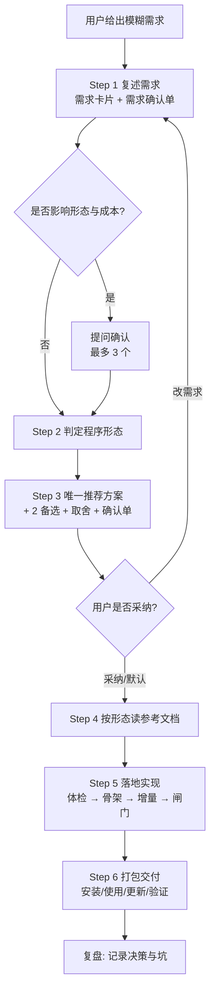

# 轻量跨平台程序构建

把一个想法变成**能装、能用、能更新**的真实程序。本 skill 的价值不在"会写代码"，而在于**替用户把技术决策做完并解释清楚**。

## 适用边界

**轻量不是代码行数少，而是运维复杂度低。** 下表是判定标准，命中右侧任一条即非轻量：

| 维度 | 轻量：本 skill 接 | 非轻量：只给架构建议，不落地 |
| --- | --- | --- |
| 使用者 | 个人/小团队，互相认识 | 陌生公众用户、海量并发 |
| 身份权限 | 无登录，或本机单用户 | 多账号登录、多租户隔离、付费鉴权 |
| 数据 | 本机文件/SQLite，单机量级 | 多人同时写、服务端数据库、审计合规 |
| 运行 | 单机/单进程/定时任务 | 7×24、SLA、多副本、K8s |
| 维护 | 1 人兼职维护，AI 能接手改 | 专职团队、on-call、发布审批流 |
| 交付 | 单文件/安装包/一条命令装好 | 商店运营、经营许可、等保备案 |

- 适用：上表左侧的工具型程序，追求**启动快、体积小、跨 Windows/macOS/Linux、安装零门槛**。
- 用户已明确形态（"用 Tauri 做个桌面应用"）也适用：跳过形态分诊，直接进入选型细化。
- 不适用：上表右侧情形；在已有项目里改 bug、加功能；纯语言语法问题。遇到这类需求明确告知"超出本 skill 范围"，只输出架构建议或按项目既有约定办；能拆出轻量部分的（如先做本地单机版验证逻辑），优先做轻量原型。

## 五条核心原则

1. **先分诊，后动手。** 没有《需求确认单》就不写代码。用户催"直接写吧"，也要先给出**你替他假设的答案 + 假设清单**，列出"假设错了会怎样"。
2. **通俗语言义务。** 每个技术决定配一句生活化解释。不说"打包成单文件静态二进制"，说"**做成双击就能用的文件，对方电脑不用先装别的东西**"；不说"六边形架构分离 core 与 adapter"，说"**把'干活的逻辑'和'外壳（命令行/窗口）'分开，以后换外壳不用重写**"。术语对照见 `references/requirement-intake.md`。
3. **单内核，多外壳。** 只要存在"以后可能要 GUI 或 CLI"的可能性，业务逻辑就放进不依赖任何界面的核心模块，界面只做输入输出。三条纪律：核心不打印、不解析参数、不直接摸系统（经端口注入）。详见 `references/hybrid-core-shell.md`。
4. **轻量优先，拒绝过度工程。** 能用单文件脚本就不建工程；能用 CLI 就不上 GUI；能用系统 WebView 就不捆绑浏览器内核。
5. **交付必须可自动化。** 安装、构建、发布一条命令跑完，多设备可重复执行。

## 总体流程

按顺序执行，**不要跳过 Step 1 和 Step 6**。菱形是两个人工确认点，其余自动推进，不要每步都问用户。

## Step 1 — 复述需求，先把话说人话

输出一段**需求卡片**（四行 + 一个确认问句）：

- **一句话目标**：把某个文件夹里 200 个照片文件按拍摄日期重命名。
- **谁来用**：只有你自己，在 Windows 上双击使用。
- **输入和输出**：输入是一个文件夹；输出是改好名字的文件和一份改名清单。
- **不做的事**：不联网、不处理视频、不做图形界面（除非你明确要）。

写法要求：无术语；用数量词让范围可见（多少文件、多久跑一次、几个人用）；末句必须是可回答的确认问句（"以上理解对吗？有没有我漏掉的场景？"）。

### 必须问清的 6 件事

完整问题库与追问技巧见 `references/requirement-intake.md`。可先跑 `python scripts/recommend.py` 做交互式初筛。

| 编号 | 大白话问题 | 决定了什么 |
| --- | --- | --- |
| Q1 | 这工具**谁用**？就你自己，还是不懂电脑的同事/客户？ | 形态与安装难度上限 |
| Q2 | 希望**怎么打开**？黑窗口敲命令、双击图标、浏览器输网址？ | CLI / GUI / Web |
| Q3 | **主要干什么**？处理文件、查数据、生成报告、长期盯事？ | 架构与是否常驻 |
| Q4 | 跑在**哪些设备**？Win/Mac/Linux/手机/服务器？有无管理员权限？ | 跨平台策略 |
| Q5 | 用**多久**、多**频繁**？一次就扔还是用几年？单次多少数据？ | 工程化投入 |
| Q6 | 维护者**熟悉什么语言**？愿装开发环境吗？ | 技术栈 |

**提问纪律**：一次最多 3 问；每问给 2–4 个具体选项并附一句后果说明，不问开放式问题；答不上来**替他选默认值并标注"假设"**。提问写法见 Step 3。

## Step 2 — 判定程序形态

按下表从上往下**第一个命中的即答案**，不要同时扔六个选项让用户挑。判定依据与决策树见 `references/decision-matrix.md`。

| 优先级 | 命中条件（大白话） | 程序形态 | 交付形态 |
| --- | --- | --- | --- |
| 1 | 只是想让电脑替自己干重复的事，人不在旁边看 | 自动化脚本 | 脚本文件 + 定时任务 |
| 2 | 需要敲命令带参数，或接进其他工具的流水线 | CLI 命令行工具 | 单文件可执行程序 |
| 3 | 要在终端看动态画面、方向键选择、实时刷新 | TUI 终端界面 | 单文件可执行程序 |
| 4 | 要网页式界面，但数据不能离开本机 | 本地 Web UI | 本地服务 + 浏览器（或桌面壳） |
| 5 | 要窗口、菜单、托盘、双击即开 | 桌面 GUI | 安装包 |
| 6 | 既要无人值守跑，也要给人看结果 | CLI + GUI 混合 | 同一核心 + 两层外壳 |

**判定红线**（硬约束，优先级高于上表）：

- **P1 例外**：即使命中自动化脚本，若使用者完全不懂技术且无人协助，不要直接跳到桌面 GUI；先看能否用一键安装脚本（含定时任务配置，见 `references/scripts-automation.md`）把复杂度包掉——能则仍做脚本，不能才升级形态。升级即成本上升，必须在确认单里写明代价。

- 需开机自启 / 托盘 / 全局快捷键 / 原生通知 / 离线大文件 → 排除纯 Web，走桌面 GUI 或 CLI + 守护进程。
- 使用者完全不懂技术且无人远程协助 → 排除需装 Python/Node 的方案，必须免安装产物。
- 需手机用 → 走响应式 Web 应用，但移动端原生不在本 skill 范围。
- 要被别的程序调用 / 进流水线 → 必须提供 CLI 或 HTTP 接口，GUI 不能是唯一入口。

平分时选更轻的，并说明"以后可以升级到 X"。先做桌面前的自检（"什么时候不要做桌面软件"）见 `references/decision-matrix.md`。

## Step 3 — 决策协议（本 skill 的灵魂）

对非技术用户用 **"一个推荐 + 两个备选 + 三条理由"** 结构：

1. **推荐方案**：明确说"我们就用 X"。理由 ≤3 条，每条对应用户可感知的好处（更快打开 / 更小体积 / 更少安装步骤）。
2. **备选方案**：各配一句"何时应换成它"。
3. **代价说明**：直说坏处（如"需装 Rust 工具链，首次构建等 1 分钟"）。
4. **决策记录**：写入 `docs/DECISIONS.md`（"日期 + 决定 + 为什么 + 放弃了什么"），正式确认单用 `assets/decision-record.md` 模板（一屏以内：结论 + 形态栈表格 + 3–5 条假设及"错了会怎样" + 确认话术"没问题回'开始'，改哪条说编号"）。

### 什么必须问，什么直接替用户定

| 类别 | 处理方式 |
| --- | --- |
| 形态（要不要界面） | 需求含糊**必须问**，给两个具象场景选项 |
| 使用者是谁、在哪台系统上用 | **必须问**，影响打包安装 |
| 数据是否允许离开本机 | **必须问**，涉隐私合规 |
| 语言与框架 | **默认替用户定**，有技术背景才给选项 |
| 目录/日志/配置文件格式 | **默认替用户定**，不问 |
| 测试与 CI | **默认做最小集**（一条冒烟脚本），不问 |

### 提问的写法

不要问"你用 Rust 还是 Go？"，要问"你更在意哪个：装完双击用，还是以后自己改方便？前者我选 Go 单文件，后者我选 Python。"——**把技术选择翻译成生活取舍**。选型时必须显式回答 4 问：**依赖谁来装？怎么升级？体积多大？出问题用户能否自己看到日志？**

## Step 4 — 默认技术栈（2026 共识）

除非用户有明确偏好，否则取**第一行命中**的方案。完整对比见 `references/decision-matrix.md`。

| 场景 | 默认方案 | 何时换 |
| --- | --- | --- |
| 自动化脚本 | Python 3.12 + `uv`（PEP 723 单文件，生态最全） | 需分发给不懂技术者 → 改单文件 CLI |
| 单文件 CLI | Go 1.23+ + Cobra/Kong（交叉编译一条命令） | 团队已写 Rust / 极致启动 → Rust + `clap` derive |
| 高性能 CLI / TUI | Rust + `clap` derive，TUI 用 `ratatui` | 要更快编译、更低门槛 → Go + Bubble Tea / Python + Textual |
| 前端型 CLI（AI 助手类） | TypeScript + `oclif` + `Ink`/`Clack` | 需单文件二进制 → `bun build --compile` |
| 本地 Web UI | Vite + React/Svelte + Hono/FastAPI（只绑 `127.0.0.1`） | 需窗口托盘 → 加桌面壳 |
| 桌面 GUI（默认） | **Tauri 2** + 任意 Web 前端（包 3–15 MB，内存 20–100 MB） | 团队只写 JS 不想碰 Rust → Electron |
| 桌面 GUI（重生态） | Electron（渲染完全一致，生态最大） | 体积内存是约束 → 换回 Tauri 2 |
| Python 团队要界面 | `pywebview` / Textual（TUI） | 需成熟打包 → 换 Tauri/Electron |
| Go 团队要界面 | Wails v2（v3 仍 alpha，慎生产） | 需移动端 → 超出本 skill 范围（只做桌面三平台） |
| 一次性数据脚本 | Python 标准库 + argparse（零依赖） | 长期维护 → Typer + Rich 工程化 |

数据锚点（讲给用户听）：Tauri 2 安装包 3–15 MB / 内存 20–100 MB / 冷启动约 0.4s；Electron 80–200 MB / 150–300 MB / 约 1.4s，差一个数量级。

## Step 5 — 落地实现

顺序不可颠倒：**环境体检 → 骨架先行 → 目录定型 → 增量补齐 → 质量闸门**。

1. **环境体检**：先跑 `./scripts/preflight.sh --form <形态> --lang <语言>`（`--mirror china` 附国内镜像提示，`--json` 机器可读），缺必需工具先装。
2. **骨架先行**：先跑通"输入 → 处理 → 输出"最短路径，哪怕只有一个功能。
3. **目录定型**：业务逻辑与界面分离（core/shell/adapters），内核模块禁界面代码，布局见各形态文档与 `references/hybrid-core-shell.md`。
4. **增量补齐**：一次只加一个能力，加完立刻自测。
5. **质量闸门**：见 `references/quality-gates.md`（G1 能跑通 → G2 格式静态 → G3 关键测试 → G4 跨平台真机 → G5 文档），未通过不得打包。

### 工程红线（不可协商）

展开见 `references/engineering-standards.md`。

- **路径一律用库**（`pathlib`/`filepath`/`path`），禁手拼 `\`/`/`。
- **换行统一 LF**：根 `.gitattributes` 写 `* text=auto eol=lf`；`.sh`/`.py` 加 shebang 并保留可执行位；仅 `.ps1`/`.bat` 允许 CRLF。
- **编码 UTF-8 无 BOM**，读写显式声明；Windows 启动设 `PYTHONUTF8=1` 或重配 stdout。
- **配置放系统标准目录**（`%APPDATA%` / `~/Library/Application Support` / `~/.config`），用 `platformdirs`/`dirs` 类库，不写安装目录。
- **日志分两级**：默认简洁，`--verbose` 才详细，落标准目录；输出颜色/进度前判 TTY 与 `NO_COLOR`。
- **退出码语义化**：0 成功、1 一般错误、2 用法错误；结果走 stdout，日志报错走 stderr。
- **不要静默失败**：禁空 `except`；错误带码（`E_...` 集中一处），用户看到人话 + 下一步动作。
- **依赖锁死版本**，提交锁文件；内部时间一律 UTC，展示转本地。
- **最小权限**：Tauri capability 默认全拒逐条开；Electron 关 `nodeIntegration` 开 `contextIsolation` + `sandbox`；本地服务只绑 `127.0.0.1`。
- **中文宽度**：终端中文占两列，`ratatui`/`Textual` 用 `unicode-width` 处理；图形界面用中文字体回退链、行高 1.6–1.7。

## Step 6 — 交付物清单

缺一项即未完成。打包、签名、更新、镜像加速见 `references/packaging-distribution.md`（谱系、签名链实操、安装脚本骨架、CI 矩阵）。

- **可运行程序**：≥1 目标平台真实产物；最终产物必须**一条命令或一次双击**能用。
- **`README.md`**：第一屏答三问（是什么 / 怎么装 / 怎么用）+ 从零跑通的复制粘贴命令 + 国内镜像说明 + 拦截绕行说明。
- **一键安装**：`scripts/install.sh` + `install.ps1`，支持 `--version --prefix --mirror --dry-run --uninstall`，幂等。
- **一键开发**：`scripts/dev.sh` / `dev.ps1`，克隆后一条命令进开发。
- **`docs/USAGE.md`**：操作说明 + 3 截图/终端录屏；**`docs/DECISIONS.md`**：Step 3 记录；卸载说明（列出所有写入位置）；验证步骤（"输出一致即装对"）。
- **发布前自查**：`references/quality-gates.md` 末尾 14 项清单逐项过一遍（含干净环境安装、卸载无残留、校验和、版本标签一致、旧版升级实测）。

## 参考文档路由表

按需读取，**一次只读当前任务需要的一篇**。

| 何时读 | 读哪篇 |
| --- | --- |
| 需求模糊、需要提问话术与术语翻译 | `references/requirement-intake.md` |
| 不确定做 CLI / 脚本 / Web / 桌面 | `references/decision-matrix.md` |
| 用户说"写个脚本自动处理……"（定时、幂等、凭据） | `references/scripts-automation.md` |
| 做命令行/TUI：命令设计、输出纪律、Shell 严格模式、TUI 要点 | `references/cli-and-tui.md` |
| 做浏览器界面/本地小服务（含 Go embed、token 防抢、合规） | `references/web-app.md` |
| 做窗口程序（含成本告知、框架对比、系统集成清单） | `references/desktop-hybrid.md` |
| CLI + GUI 双形态，或预留加界面 | `references/hybrid-core-shell.md`（内核三纪律、四语言布局、错误映射、迁移成本；sidecar 进阶可跳过） |
| 打包、签名、发版、自动更新、国内加速（含签名链实操与安装脚本骨架） | `references/packaging-distribution.md` |
| 目录结构、配置、日志、测试、CI | `references/engineering-standards.md` |
| 测试、Lint、验收标准 | `references/quality-gates.md` |
| 提示词怎么写、怎么问用户 | `references/prompt-recipes.md`；给用户自用的模板见 `assets/prompt-templates.md` |
| 输出方案确认单 | `assets/decision-record.md` |
| 看三个完整案例从头到尾怎么走 | `references/case-walkthroughs.md` |
| 动手前检查本机工具链 | `scripts/preflight.sh`；做形态初筛 | `python scripts/recommend.py` |

## 沟通与输出规范

- **进度心跳**：每完成一步简短汇报一句，不长时间静默。
- **决策透明**：每个选择给"理由 + 放弃备选的理由 + 代价"；**可回退**：说明"从 A 换到 B 的成本"。
- **不甩术语**：英文术语首次出现给中文（如 CLI 命令行界面）；结构对比优先表格与 mermaid。
- **禁止**：未经确认大规模改动；把选型选择题原样抛给小白；推荐没把握的冷门框架。

## 高频坑位（Gotchas）

- **"跨平台"≠"我机上能跑"**：Win 的 `SIGTERM` / 符号链接 / 文件锁 / 进程树终止 / 260 字符上限皆不同，三平台各跑冒烟。
- **PyInstaller 不能交叉编译**：Win exe 必须 Win 上打，或 GH Actions 三平台矩阵；另有杀软误报风险，提前告知。
- **Tauri WebView 系统自带**（Win WebView2 / mac WKWebView / Linux WebKitGTK）：同 CSS 渲染不同，关键样式兼容测；Linux 需装 WebKitGTK；Win10 老机器需引导装 WebView2。
- **macOS 分发链不可拆**：签名 → 公证 → 才能静默更新；未签名报"已损坏"，交付时给右键打开 / `xattr -dr com.apple.quarantine` 说明，优先签名公证；签名与平台绑定，CI 需三平台矩阵。
- **国内网络**：npm/pip/cargo/Go 给镜像配置；GH 释放文件可给代理前缀备选并注明需核实可用性；尊重 `HTTP(S)_PROXY`。
- **版本号不写死正文**，写"以官方为准 + 查询命令"（如 `npm view tauri version`）；`description` 是触发器，改 skill 时同步写清"做什么 + 何时用"。

## 依据与知识边界

- Agent Skills 结构与渐进式披露：agentskills.io《Specification》、Anthropic《The Complete Guide to Building Skills》（`SKILL.md` ≤500 行，引用一层深；本 skill references 较多，但路由表保证一次只读一篇）。
- 桌面框架数据：Tauri 官方 + 2026 第三方评测交叉（包 3–15 MB 对 Electron 80–200 MB；内存 20–100 MB 对 150–300 MB；冷启动约 0.4s 对 1.4s）；Wails 数据为厂商口径，引用标注。
- CLI 共识：Cobra（Go）、`clap` derive（Rust）、Typer + Rich（Python）、`oclif` + `Ink`（TS）为 2026 主流选择。
- **知识截止 2026-06**，版本用包管理器命令核实，以官方文档为准。
