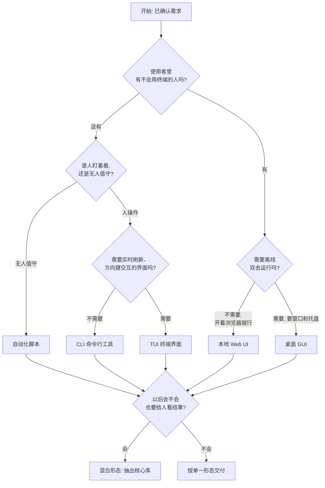
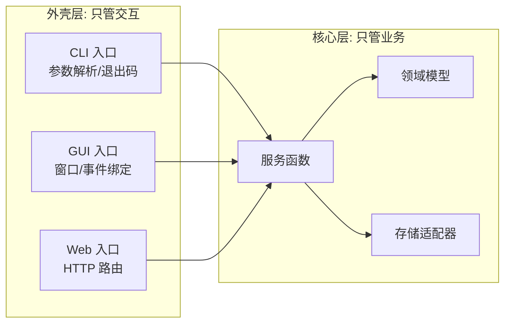

# 形态判定与技术选型矩阵

先定形态，再定技术栈。顺序颠倒是最常见的返工原因。

## 目录

- 六种形态对照
- 判定流程图
- 语言选择矩阵
- 桌面框架横向对比
- 不要做桌面软件的五个信号
- 混合形态的正确拆法
- 需求细化十二问

## 六种形态对照

| 形态 | 谁在用 | 在哪跑 | 怎么交付 | 典型代表 |
| --- | --- | --- | --- | --- |
| 自动化脚本 | 作者本人 | 本机或服务器定时触发 | 脚本文件 + 调度配置 | 清理下载目录的定时任务 |
| CLI 命令行 | 自己或开发者同行 | 终端里敲命令 | 单文件可执行程序 | `ripgrep`、`gh` |
| TUI 终端界面 | 习惯终端的人 | 终端全屏 | 单文件可执行程序 | `btop`、`lazygit` |
| 本地 Web UI | 不想碰终端的人 | 浏览器访问本机端口 | 桌面应用或本地服务 | 各类本地管理面板 |
| 桌面 GUI | 普通用户 | 双击图标 | 安装包 | VS Code、Typora |
| CLI + GUI 混合 | 两类人同时用 | 两种都要 | 同一核心 + 两层外壳 | `git` 与 `gitui`/GUI 客户端 |

**判定的第一问永远是：使用者会不会敲命令？** 会 → CLI/脚本；不会 → 必须有图形界面；两者都有 → 混合形态。

## 判定流程图

图中的关键分叉是**"会不会也要给人看结果"**。这个判断越早做越省钱：如果答案是"会"，就要从第一天起把业务逻辑和界面分开写，否则后期拆分成本极高。

## 语言选择矩阵

| 你的情况 | 首选 | 次选 | 一句话原因 |
| --- | --- | --- | --- |
| 完全不懂编程，只要能用 | Python | 不需要次选 | 生态最全，出问题网上答案最多 |
| 要发给不懂技术的朋友用 | Go 或 Rust 单文件 | Electron/Tauri 安装包 | 对方"下载、双击"就结束 |
| 团队已经写 JavaScript/TypeScript | TypeScript | Go | 不换语言，学习成本为零 |
| 团队已经写 Go | Go | Rust | 编译快、贡献者好找 |
| 团队已经写 Python | Python | Go | 复用既有代码与数据处理能力 |
| 需要毫秒级启动、常驻后台 | Rust 或 Go | TypeScript | 无解释器启动开销 |
| 要处理大量文本/文件、追求吞吐 | Rust | Go | 无 GC、内存可控 |
| 要接 AI/机器学习模型 | Python | TypeScript 调 API | 模型生态在 Python 这边 |

**重要提醒**：语言本身不该是用户的问题。当用户说"我不懂技术"时，直接替他定语言，并把选择理由翻译成"装起来快不快、改起来难不难"这类说法。

## 桌面框架横向对比

| 维度 | Tauri 2 | Electron | Wails v2 | Neutralino | pywebview |
| --- | --- | --- | --- | --- | --- |
| 后端语言 | Rust | Node.js | Go | C++ + JS | Python |
| 渲染引擎 | 系统 WebView | 自带 Chromium | 系统 WebView | 系统 WebView | 系统 WebView |
| 安装包体积 | 约 3–15 MB | 约 80–200 MB | 约 8–15 MB（厂商口径） | 约 2 MB | 约 20–30 MB |
| 空闲内存 | 约 20–100 MB | 约 150–300 MB | 约 10–30 MB（厂商口径） | 约 15–30 MB | 中等 |
| 各平台渲染一致性 | 有差异 | 完全一致 | 有差异 | 有差异 | 有差异 |
| 移动端 | 支持 iOS/Android | 不支持 | 不支持 | 不支持 | 不支持 |
| 安全模型 | capability 白名单，默认全拒 | 需手动关闭 Node 集成 | 常规 | 常规 | 常规 |
| 上手门槛 | 需要装 Rust 工具链 | 最低 | 低 | 低 | 低 |
| 生态成熟度 | 高且增长快 | 最高 | 中 | 低 | 低 |
| 适合 | 新项目默认选择 | 需要最大生态与一致渲染 | Go 团队 | 极简工具 | Python 团队 |

**结论**：2026 年新项目的桌面默认答案是 **Tauri 2**。换成 Electron 的条件只有两个——团队完全只写 JavaScript 且不愿引入任何 Rust，或者强依赖某个只有 Electron 才有的成熟插件。

**一致性的坑**：Tauri 在 Windows 用 WebView2、macOS 用 WKWebView、Linux 用 WebKitGTK，三处对 CSS 新特性、字体渲染、滚动条样式的支持不同。凡涉及精细排版，必须在三个平台各看一眼。

## 不要做桌面软件的五个信号

1. **用户只在服务器上跑** → 做 CLI 加可选 Web 面板。
2. **界面只是一张表单加一个按钮** → 做本地 Web UI，省掉签名、公证、更新器一整套负担。
3. **工具每周只用一次** → 浏览器标签页比安装包更友好。
4. **需要在手机上也能用** → 直接做响应式 Web 应用。
5. **团队没人维护原生构建链** → 桌面应用的签名、公证、自动更新是长期运维成本，不是一次性成本。

## 混合形态的正确拆法

混合形态（CLI 和 GUI 并存）的核心不是"写两个程序"，而是**把业务逻辑抽成独立核心，外壳只做输入输出**。

三条落地规则：

- **核心层禁止打印日志到控制台、禁止弹窗、禁止读命令行参数**。它只返回数据或抛出结构化错误。
- **每个外壳各自有一个极薄的入口文件**，例如 `cmd/app/main.go`、`src-tauri/src/main.rs`、`web/server.ts`。
- **进度反馈用统一的进度结构**（百分比 + 当前步骤文案），CLI 把它渲染成进度条，GUI 渲染成进度环。这样三种外壳看到的世界是同一个。

## 需求细化十二问

用户的原始描述通常只覆盖前两问。逐项补齐，缺哪项就在需求卡片里替用户做默认假设并标注出来。

1. 这个工具解决的是什么重复劳动？
2. 谁用？几个人用？
3. 在什么设备上用？操作系统是什么？
4. 会不会敲命令？
5. 数据能放本机，还是必须传到云端？
6. 一次处理的数据量有多大？（100 个文件和 10 万个文件是两个项目）
7. 多久用一次？
8. 出错时希望程序怎么表现？（停下来问，还是跳过并记录）
9. 需要保留历史记录或撤销能力吗？
10. 需要在没有网络的环境下工作吗？
11. 谁来维护？半年后还有人记得怎么改吗？
12. 有没有必须遵守的合规或保密要求？
