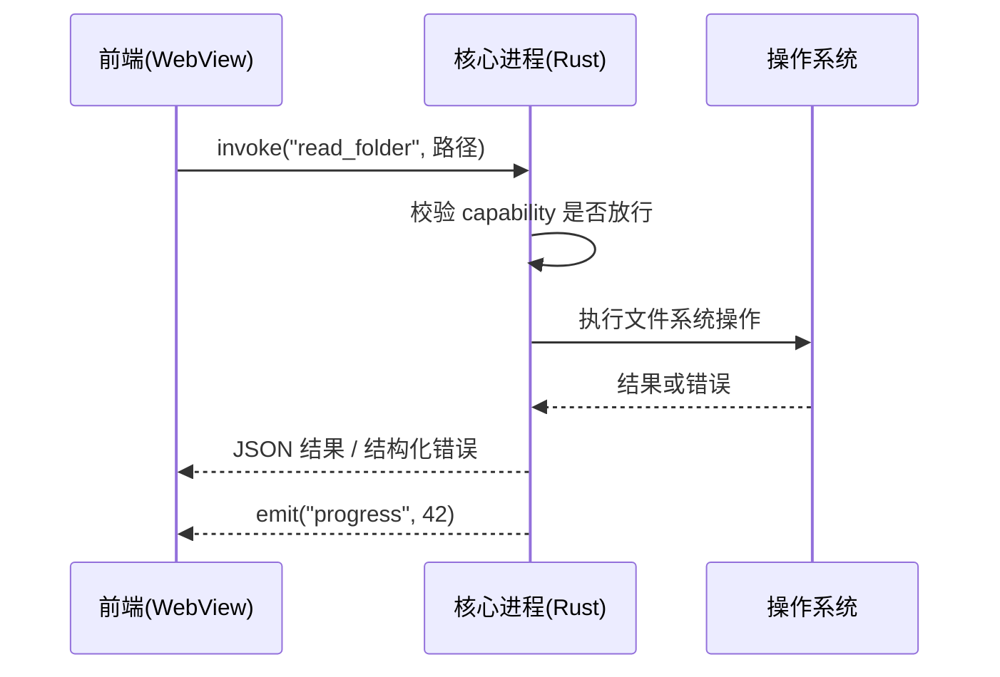
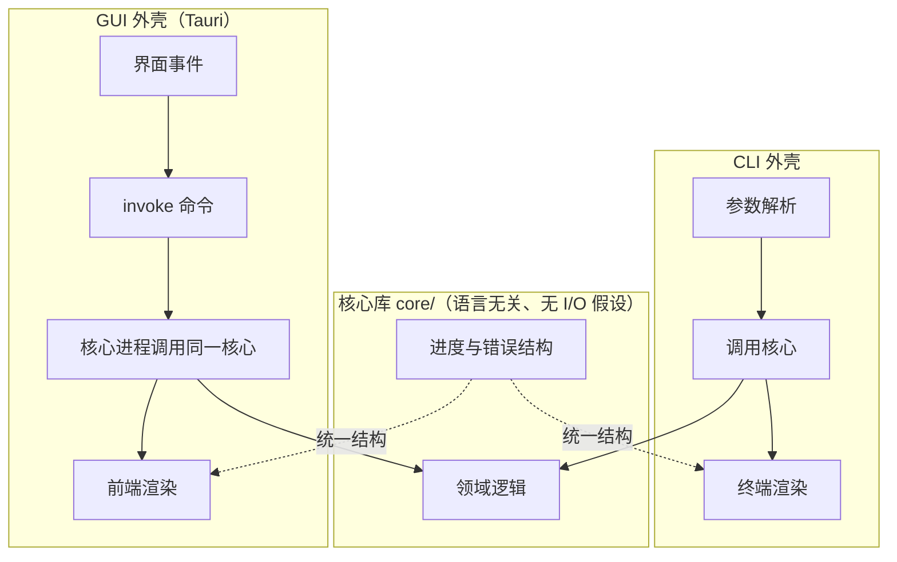

# 桌面 GUI 与 CLI+GUI 混合构建

> 开篇警示：桌面软件的真正成本不在写界面，而在签名、公证、自动更新、三平台构建链这四件长期运维事。
> 三平台须分别构建，签名与公证各自独立，更新需自建通道并维持签名链不断。
> 未签名程序会被系统拦截（Windows SmartScreen、macOS Gatekeeper），普通用户不知道怎么绕过。
> 体积量级：Tauri 约 3–15 MB、Wails 约 8–15 MB、Electron 约 80–200 MB、极简方案约 2 MB。
> 接受不了这个持续成本就退回本地 Web UI，工程量约减半且免签名公证。

## 目录

- 技术选型结论
- Tauri 2 进程模型
- capability 权限配置字段表
- Electron 的使用条件与安全清单
- Go 与 Python 的替代路线
- CLI + GUI 混合架构
- 系统集成清单
- 数据存储
- 三平台差异坑位

## 技术选型结论

| 框架 | 后端语言 | 渲染引擎 | 体积 / 内存量级 | 适合谁 |
| --- | --- | --- | --- | --- |
| Tauri 2（默认答案） | Rust | 系统 WebView | 约 3–15 MB / 约 20–100 MB | 新项目、在意体积与内存，能接受一点 Rust |
| Electron | Node.js | 自带 Chromium | 约 80–200 MB / 约 150–300 MB | 只写 JavaScript、要最大插件生态、要三平台渲染完全一致 |
| Wails v2 | Go | 系统 WebView | 约 8–15 MB / 较低 | Go 栈（v3 仍在 alpha，生产用 v2） |
| pywebview | Python | 系统 WebView | 介于 Tauri 与 Electron 之间 | Python 数据工具，不想学新语言 |
| 其他 | — | — | — | 极简选 Neutralino；C# / Dart 原生栈（Qt / .NET MAUI / Flutter）另议 |

核心权衡：Tauri 用渲染一致性换体积与内存（Windows 走 WebView2，macOS / Linux 走 WebKit，同一份 CSS 有细微差异）；Electron 用体积与内存换确定性（自带 Chromium，三平台一致，资料最丰富）。
换框架不解决分发难题：证书、公证、更新服务器、商店提交，哪条路都得自己走。

## Tauri 2 进程模型



要记住的事：前端永远不直接碰系统资源，一切通过命名命令（command）转发给核心进程；核心进程可主动向前端推送事件（例如进度），这是进度条与状态刷新的标准通道。

关键点：

- 前端就是普通 Web 项目，Vite、React、Svelte 照用，与"本地 Web UI"篇的前端规范一致，从 Web UI 升级到桌面几乎不用重写。
- 核心进程用 Rust 写，但多数工具只需几十行命令转发：收参、调核心库、返结果，不需要精通 Rust。
- 重计算放核心进程，避免阻塞界面线程。
- Rust 侧命令保持"薄"，参数校验后调核心逻辑，错误转成前端可序列化的结构（正式项目用错误枚举而非裸字符串，以便区分"路径不存在"与"无写入权限"）。

## capability 权限配置字段表

Tauri 2 默认拒绝一切能力，必须在 `src-tauri/capabilities/*.json` 里逐条放行。这是它安全性的来源，也是新手最容易卡住的地方。

```json
{
  "identifier": "main-capability",
  "windows": ["main"],
  "permissions": ["core:default", "fs:allow-read-text-file", "dialog:allow-open"]
}
```

| 字段 | 含义 | 不写会怎样 |
| --- | --- | --- |
| `identifier` | 这份能力规则的唯一名字 | 启动报配置解析错误 |
| `windows` | 规则作用于哪些窗口，对应 `WebviewWindow` 的标签 | 所有窗口拿不到权限，或者权限过宽 |
| `permissions` | 具体放行的权限点，格式为 `插件:具体动作` | 前端调用返回 permission denied，常被误认为代码 bug |

排错顺序：先查 capability 的 `windows` 标签与窗口标签是否一致，再查 `permissions` 是否含对应插件动作，最后才查代码；默认无权限，"调用没反应"多半是没配全。

## Electron 的使用条件与安全清单

选 Electron 的三个合理理由：团队只写 JavaScript；强依赖某个只有 Electron 才有的成熟模块；需要三平台像素级一致的渲染。

安全三铁律（硬要求，一条都不能松）：

- `nodeIntegration: false`：渲染进程不给 Node 权限，所有系统能力走白名单。
- `contextIsolation: true`：渲染进程与 preload 处于隔离 JS 上下文，网页代码摸不到 Node。
- `sandbox: true`：渲染进程启用 Chromium 沙箱。

配套做法：

- 通过 `preload` 脚本经 `contextBridge` 只暴露最小白名单方法，不把整个 `ipcRenderer` 递给前端。
- 渲染进程设 CSP，禁止远程代码加载。
- 需要返回值用 `invoke` / `handle`（请求-响应），进度推送用反向事件；两者不混用。
- Electron 自带 Chromium，必须跟进安全更新，这是选它之后的长期义务。
- 打包工具二选一：Electron Forge（官方维护）或 electron-builder（社区维护、内置自动更新），不要混用。

## Go 与 Python 的替代路线

- Wails（Go）：写 Go 方法自动生成 TypeScript 绑定，前端像调本地函数一样调用；产物小、体验顺，代价是社区小于 Tauri，生产用 v2。
- pywebview（Python）：Python 起窗口装 WebView，前端可用任意静态页面；适合已有 Python 逻辑的场景，体积介于 Tauri 与 Electron 之间。
- Textual（Python TUI）：如果"界面"只是想好看一点，全屏终端应用可省掉整个打包链。

## CLI + GUI 混合架构

混合形态的目标是一份核心逻辑、两种外壳、零重复实现。界面与内核分离的通用分层原则见 `hybrid-core-shell.md`，此处只规定桌面侧落地。



四条实现规则：

- 核心库不打印、不弹窗、不读命令行，只返回数据或抛带错误码的结构化错误。
- 进度用统一结构：`{stage, current, total, message}`，CLI 渲单行进度条，GUI 渲进度环，同源。
- 错误带错误码（如 `E_FILE_NOT_FOUND`、`E_PERMISSION`），GUI 据此显示友好文案，CLI 据此定退出码。
- CI 为三种外壳各备一条冒烟测试：核心库单测、CLI 直接调用、GUI 无头启动再关闭，避免静默回归。

升级路径：先做 CLI（先让逻辑正确）→ 加 Web UI（让更多人能用）→ 需桌面体验再套 Tauri 壳，每步都不重写核心。

## 系统集成清单

桌面价值一半来自碰操作系统，逐项确认是否需要：

| 能力 | 关键做法（一句话） |
| --- | --- |
| 文件对话框 | 用官方 dialog 能力（Tauri `plugin-dialog` / Electron `dialog`），大文件走流式处理不一次读入内存。 |
| 拖拽进窗口 | 开启拖拽能力并处理与 WebView 默认行为的冲突，Electron 侧用安全 API 取路径。 |
| 系统托盘 | Tauri 用 tray 特性、Electron 用 `Tray`，关闭窗口默认藏托盘而非退出时须在文档写明，Linux 下图标可能不显示。 |
| 原生通知 | 用官方通知能力，macOS 需签名后表现才稳定，Windows 需配 AppUserModelID。 |
| 剪贴板 | 用官方剪贴板能力（Tauri `plugin-clipboard-manager` / Electron `clipboard`）。 |
| 开机自启 | 用官方自启能力，不手改注册表或 launchd，Linux 实为写 `.desktop` 到 autostart。 |
| 全局快捷键 | 用官方 global-shortcut 能力，必须提供关闭或改键开关以免冲突。 |
| 自动更新 | 用官方 updater 配签名公钥与版本清单，macOS 未签名无法静默更新，见打包发布篇。 |
| 深度链接 | 注册 `myapp://` 协议（Tauri `plugin-deep-link` / Electron `setAsDefaultProtocolClient`），用于浏览器跳回应用。 |
| 单实例锁 | 用单实例能力（Tauri `plugin-single-instance` / Electron `requestSingleInstanceLock`），防双击开出多份。 |

另注意：多窗口须在 capability 的 `windows` 里逐个授权；深色模式跟随系统主题、用 CSS 变量切换，不写死颜色。

界面三件事：窗口设最小宽高并记住用户上次尺寸；重活放窗口显示之后异步做，首屏不白屏等待；空状态给开始入口、错误状态给"原因 + 重试"，这比视觉风格更关键。
前端框架与组件选型保持与 Web UI 篇一致并与桌面壳解耦，同一份界面日后可直接部署为 Web 版；优先轻量组件方案，避免重型 UI 库在 WebKit 上的兼容坑。

## 数据存储

- 结构化数据用 SQLite（Tauri 经插件或 Rust 侧直连，Electron 在主进程侧用驱动）。
- 少量设置放 JSON / TOML，原子写入（先写临时文件再重命名，防断电损坏）。
- 用户文档图片放用户可见目录，不藏进应用数据目录；程序内部数据一律经官方 API 取目录。
- 必须实现导出导入（换电脑）、自动备份（保留最近 N 份）、带版本号的迁移脚本。
- 连接池等全局状态放核心进程持有，前端不直连数据库；备份与迁移纳入冒烟测试先测通。

## 三平台差异坑位

- 渲染不一致：Tauri 依赖系统 WebView，CSS 新特性支持度不同，避免过新特性，关键页面三平台各看一次。
- Linux 依赖：WebKitGTK 需装系统库，安装脚本覆盖主流发行版（Debian / Ubuntu、Fedora、Arch）。
- Windows WebView2：Win11 自带，部分 Win10 需另装，安装器引导下载（`downloadBootstrapper` / `embedBootstrapper` / `offlineInstaller` 三策略选一）。
- 路径与数据目录：一律经官方 API（Tauri `app_data_dir`、Electron `app.getPath('userData')`），不手拼 `~`。
- macOS 未签名：提示"已损坏，无法打开"，短期在文档写 `xattr -dr com.apple.quarantine` 去检疫，长期做签名加公证。
- 桌面专项验收（冷启动、内存基线、卸载干净、无签名指引、崩溃日志路径）见 `quality-gates.md`，此处不重复。
