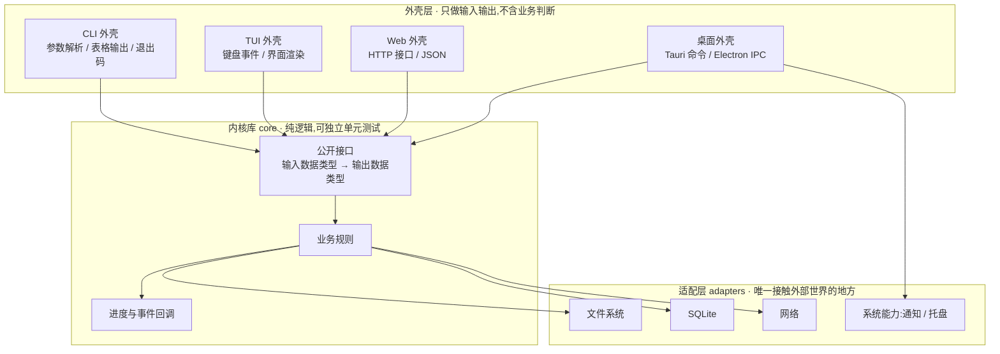
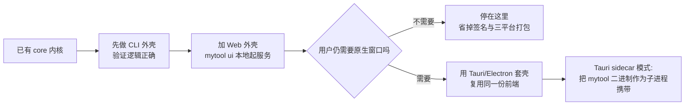

# 形态参考:CLI + GUI 双形态(共享内核)

> 何时读本文件:用户既要"能脚本化批量跑",又要"给人点鼠标";或者你判断这个工具**将来很可能**要加界面。
>
> 这是本 skill 最推荐的架构范式,即使当前只做单一形态,也应按此布局留后路。

## 为什么不要写两份

最常见的失败路径:先写了个 CLI,后来用户说"能不能加个界面",于是在 CLI 代码里到处插 `print`,再复制一份逻辑写界面 —— 结果两套逻辑各自演化,修一个 bug 要改两处,最终其中一份烂掉。

正确做法:**业务逻辑只写一份,做成一个不认识任何界面的"内核库",CLI 和 GUI 都只是它的薄外壳。**



## 内核层的三条纪律

| 纪律 | 具体要求 | 违反的后果 |
| --- | --- | --- |
| **不打印** | 内核里禁止 `print` / `console.log` / `fmt.Println`。要输出信息,通过返回值或**回调函数**交给外壳 | 界面里冒出终端日志;Web 接口把日志混进 JSON |
| **不解析参数** | 内核接收的是**已经解析好的数据结构**(如 `RenameOptions`),不是字符串数组 | 换外壳时要重写校验逻辑 |
| **不直接摸系统** | 文件、数据库、网络都通过接口(端口)注入,内核只依赖抽象 | 无法在测试里用假数据替换,测试变慢变脆 |

**进度反馈的正确写法**:内核接受一个可选的回调/通道,例如 Python 的 `on_progress: Callable[[Progress], None] | None`,Go 的 `chan Progress`,Rust 的 `mpsc::Sender<Progress>`。CLI 把它接到进度条,Web 把它接到 SSE/WebSocket,TUI 接到界面状态 —— 同一份逻辑,四种表现。

## 各语言的推荐布局

### Python:一个包 + 多种入口

```
mytool/
├── pyproject.toml
├── src/mytool/
│   ├── core/
│   │   ├── models.py       # dataclass / pydantic 数据模型(输入输出契约)
│   │   ├── renamer.py      # 纯逻辑函数,不 import typer/fastapi
│   │   └── ports.py        # Protocol 定义:文件访问、时钟、随机源
│   ├── adapters/
│   │   ├── fs.py           # 真实文件系统实现
│   │   └── db.py           # SQLite 实现
│   ├── shells/
│   │   ├── cli.py          # Typer
│   │   ├── tui.py          # Textual(可选)
│   │   └── web.py          # FastAPI(可选)
│   └── py.typed
└── tests/
    ├── test_core.py        # 只测 core,不需要终端也不需要网络
    └── test_shells.py      # CliRunner / TestClient 薄测试
```

`pyproject.toml` 里同时声明多个入口:

```toml
[project.scripts]
mytool = "mytool.shells.cli:app"        # 命令行入口
mytool-ui = "mytool.shells.web:serve"   # 本地 Web UI 入口
```

`core/renamer.py` 的样子(注意没有任何界面依赖):

```python
from collections.abc import Callable
from dataclasses import dataclass

from mytool.core.ports import FileSystem
from mytool.core.models import RenameItem, RenameOptions


@dataclass(frozen=True)
class Progress:
    done: int
    total: int
    current: str


def plan(fs: FileSystem, options: RenameOptions) -> list[RenameItem]:
    """只负责算出改名计划,不执行、不打印。"""
    files = fs.list_images(options.folder)
    return [
        RenameItem(old=p, new=options.pattern.format(index=i, date=fs.mtime(p)))
        for i, p in enumerate(sorted(files), start=1)
    ]


def apply(
    fs: FileSystem,
    items: list[RenameItem],
    on_progress: Callable[[Progress], None] | None = None,
) -> int:
    """执行改名,通过回调上报进度;返回成功数量。"""
    for i, item in enumerate(items, start=1):
        fs.rename(item.old, item.new)
        if on_progress is not None:
            on_progress(done=i, total=len(items), current=item.new.name)
    return len(items)
```

外壳各自决定"进度长什么样":CLI 用 Rich 的 `Progress`,Web 用 SSE 推送,TUI 更新界面状态。

### Go:一个仓库,多个 `cmd`

```
mytool/
├── go.mod
├── cmd/
│   ├── mytool/main.go      # CLI 入口(Cobra)
│   └── mytool-ui/main.go   # 可选:内嵌前端的 Web UI 入口
├── internal/core/          # 业务逻辑,不 import cobra / net/http
├── internal/adapters/
├── web/                    # 前端源码(Vite 项目)
│   └── dist/               # 构建产物,被 go:embed 打进二进制
└── .goreleaser.yaml
```

**更省事的变体:一个二进制,子命令切换外壳。** 这是轻量工具的常见做法:

- `mytool rename ./photos --pattern "{date}-{index}"` —— 直接跑
- `mytool ui` —— 启动本地 Web UI 并打开浏览器
- `mytool rename ./photos --json` —— 给别的脚本调用

好处是**只需要分发一个文件**,用户不必理解两个程序的关系。

### Rust:cargo workspace

```
mytool/
├── Cargo.toml              # [workspace] members = ["crates/*", "apps/*"]
├── crates/
│   ├── mytool-core/        # lib crate,零界面依赖
│   └── mytool-adapters/
├── apps/
│   ├── mytool-cli/         # bin crate,clap
│   └── mytool-desktop/     # Tauri app,依赖 mytool-core
└── web/
```

Rust 的天然优势:`core` 是 lib crate,CLI 和 Tauri 都把它当依赖引用,**编译器强制保证两边行为一致**;Tauri 的 `#[tauri::command]` 只是把 core 的函数暴露给前端。

### TypeScript:pnpm/npm workspaces 单仓多包

```
mytool/
├── pnpm-workspace.yaml
├── packages/
│   ├── core/               # 纯 TS,不依赖 DOM 也不依赖 node:fs
│   ├── cli/                # 依赖 core + Commander
│   └── web/                # 依赖 core + React
└── apps/
    └── desktop/            # 可选:Tauri/Electron 壳,复用 packages/web
```

关键收益:**`core` 的类型定义在前端和 CLI 之间共享**,改一个字段两边编译同时报错,不存在"接口对不上"。

## 桌面壳如何复用 Web 壳

一旦有了本地 Web UI,升级到桌面应用几乎是"套一层壳":



> 进阶内容，可跳过。新项目优先"前端复用 + core 直调"；只有 CLI 已成熟、不想重写时才看 sidecar。
>
> **Tauri sidecar(边车)模式说明**:把已有的 CLI 二进制作为 Tauri 应用的外部可执行文件一起打包,前端通过 Tauri 的 `shell` 插件以子进程方式调用它。适合"CLI 已经很成熟、不想用 Rust 重写业务逻辑"的情况。代价是要处理子进程生命周期、跨平台可执行文件后缀(`.exe`)与权限声明。

## 契约管理:外壳之间靠什么对齐

| 契约类型 | 载体 | 说明 |
| --- | --- | --- |
| **数据结构** | 类型定义(pydantic / Go struct + json tag / TS interface / serde) | 单一来源,禁止各外壳自己复制一份 |
| **错误** | 错误码枚举 + 人类可读消息 | CLI 映射成退出码,Web 映射成 HTTP 状态码,GUI 映射成弹窗文案 |
| **进度** | 统一的 `Progress` 事件 | 各外壳自行决定渲染方式 |
| **版本** | 内核暴露 `version()`,所有外壳都从这里取 | 避免 `mytool --version` 与界面右下角显示的版本号不一致 |

**错误映射表**建议直接写在仓库文档里:

| 内核错误 | CLI 退出码 | HTTP 状态 | GUI 表现 |
| --- | --- | --- | --- |
| `PathNotFound` | 2 | 400 | 输入框标红 + "找不到这个文件夹" |
| `PermissionDenied` | 1 | 403 | 弹窗 + "没有权限,试试以管理员身份运行" |
| `Conflict` | 1 | 409 | 列出冲突项,提供"跳过/覆盖"按钮 |
| `Internal` | 1 | 500 | "出错了,日志在 XXX 路径,请把内容发给我" |

## 迁移路径(给用户的"以后怎么办"答复)

用户经常问:"我现在先做个简单的,以后想升级会不会白费?" 标准答复:

1. **脚本 → CLI**:把顶层代码抽成函数、加上参数解析,半天工作量。前提是脚本没有把逻辑全塞在一个 `main` 里。
2. **CLI → CLI + 本地 Web UI**:内核不动,新增一个 Web 外壳,一到三天。
3. **本地 Web UI → 桌面应用**:前端不动,套 Tauri 壳,主要成本在**打包、签名、公证**,而非代码。
4. **本地 → 服务端 Web**:需要补鉴权、多用户数据隔离、部署与备份,这一步成本最高,**不要承诺"顺手就能改"**。

只要一开始就守住"内核不打印、不解析参数、不直接摸系统",前四步都是加法而非重写。

## 双形态专项质量闸门

| 检查项 | 通过标准 |
| --- | --- |
| 内核测试独立性 | `core` 的测试不启动终端、不绑定端口、不写真实用户目录 |
| 外壳厚度 | 每个外壳文件行数远小于内核;外壳里搜不到业务判断语句(`if` 决定业务规则) |
| 行为一致性 | 同一输入,CLI 与 GUI 的结果**逐字节相同**;把这条写进端到端测试 |
| 状态同源 | UI 的可用/禁用/加载/成功/失败皆从 `core` 状态派生;同一操作在 CLI 与 GUI 的禁用条件一致,不出现"CLI 报无权限但 GUI 按钮还能点" |
| 版本一致 | `mytool --version`、界面关于页、安装包元数据三者一致 |
| 文档一致 | README 里 CLI 用法与界面截图对应同一版本功能,不出现"文档写了但界面没有" |
