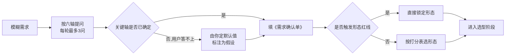

# 需求分诊与通俗表达手册

> 本文件在 `SKILL.md` 阶段一被读取。目标:把用户一句模糊的话,变成一张可执行的《需求确认单》,并且全程说人话。

## 为什么需要分诊

用户的原始表达通常是这样的:

- "我想做个小工具管理一下我的读书笔记。"
- "能不能帮我自动化一下每周的报表?"
- "我想要一个软件,客户可以自己填单子。"

这三句话背后可能对应**完全不同的形态**:第一个可能是本地数据库 + 桌面窗口,也可能就是一个 Markdown 文件加一个 CLI 搜索命令;第二个几乎肯定是一个脚本;第三个是一个 Web 应用。**猜错的代价是返工,所以必须先问。**

但提问不等于把责任推回给用户。规则是:**问具体选项,不问开放问题;用户答不上来就由你定默认值并标注为假设。**

## 六轴问题库

每一轴给出:问法(大白话)、选项、以及每个选项**导向的技术后果**。

### 轴一:使用者是谁

| 选项 | 大白话问法 | 技术后果 |
| --- | --- | --- |
| A | 只有我自己用,我能在终端里敲命令 | 可用 CLI/脚本,允许依赖已装好的开发环境 |
| B | 我和几个懂点电脑的同事 | CLI 可以,但最好提供一键安装脚本 |
| C | 完全不懂电脑的人(客户、长辈、业务同事) | **必须**免安装双击产物或网页链接,禁止要求装运行时 |
| D | 互联网上的陌生用户 | 必须 Web 部署或走应用商店/包管理器,要考虑签名与安全 |

### 轴二:交互方式

| 选项 | 大白话问法 | 技术后果 |
| --- | --- | --- |
| A | 敲一行命令,出结果就结束 | 单文件脚本或 CLI |
| B | 在终端里像用菜单一样上下选择、实时看数据滚动 | TUI(终端用户界面) |
| C | 有窗口、按钮、能拖拽文件进去 | 桌面 GUI |
| D | 打开浏览器就能用,不用装东西 | Web 应用 |
| E | 程序在后台一直跑,有事通知我 | 守护进程/计划任务 + 可选 CLI 控制 |

### 轴三:核心工作内容

问法:"它最主要干的那件事,能一句话说清吗?" 归类:

| 类别 | 典型例子 | 架构要点 |
| --- | --- | --- |
| **转换** | 改文件名、格式转换、压缩图片 | 纯函数式内核,批处理,进度条,失败可续跑 |
| **收集** | 抓网页、调 API、读传感器 | 重试、限速、超时、缓存、断点续传 |
| **整理** | 记账、笔记、库存 | 本地数据库(SQLite),导入导出,备份 |
| **生成** | 出报告、生成图表、拼文档 | 模板引擎,导出格式(PDF/Excel/Markdown) |
| **监控** | 盯价格、盯日志、盯任务状态 | 定时调度,状态持久化,通知渠道 |
| **交互服务** | 让别人填表、预约、投票 | 需要服务端、鉴权、并发、数据校验 |

### 轴四:运行平台

问法:"你会在什么设备上用它?别人呢?" 需要确认的最小集合:**Windows / macOS / Linux / 手机 / 服务器**。
追问一句关键的:"你公司发的电脑是 Windows 还是 Mac?有没有权限自己装软件?" —— 很多方案死在**企业设备无管理员权限**上。

### 轴五:生命周期与规模

| 问法 | 短命(用完就扔) | 长期(用几年) |
| --- | --- | --- |
| 工程化投入 | 单文件、零依赖、能跑就行 | 目录分层、测试、CI、版本发布、变更日志 |
| 数据处理量 | "几十个文件" → 内存里搞定 | "几十万个文件" → 流式处理 + 索引 + 进度可恢复 |
| 是否多人维护 | 注释够清楚即可 | 需要 README、贡献指南、Lint 强制 |

### 轴六:维护者的技术底细

问法:"以后这个程序谁来改?他会什么语言?愿不愿意装开发工具?"

**关键判断**:如果答案是"没人会改",那么**技术栈的新潮程度不重要,可维护性和依赖数量才重要**。此时优先:

1. 依赖最少(能标准库就标准库);
2. 语言普及度高、AI 助手能轻松接续维护(Python、TypeScript、Go);
3. 避开需要复杂工具链才能构建的方案(例如需要特定版本 CUDA、需要 Xcode 签名账号才能出包)。

## 追问技巧

**技巧一:用"如果……你会怎么办"逼出真实需求。**
用户说"我要个数据库管理系统",你问:"假设明天数据库里有一万条记录,你最常做的那个操作是什么?" —— 答案往往揭示真正需要的是一个搜索框,而不是管理系统。

**技巧二:找现有的参照物。**
"你希望它用起来像什么?像 Excel、像微信、像命令行里的 `git`,还是像某个你用过的网站?" 参照物比形容词有效十倍。

**技巧三:量化一切形容词。**
用户说"要快"→ 问"多少条数据、几秒内算快";说"要好看"→ 问"是给自己看着舒服,还是要拿给客户展示专业度";说"要安全"→ 问"担心的是别人看到数据,还是担心程序把数据弄丢"。

**技巧四:主动暴露成本。**
"做成桌面双击图标,比做成命令行工具多花大约 X 倍时间,而且每次更新都要重新打包三个系统。你还需要双击吗?" —— 很多"想要 GUI"的需求在这一步会自动撤回。

**技巧五:一次最多三个问题,并允许用户说"你定"。**
用户说"你定"时,不要追问,直接给出你的选择 + 理由 + 反悔成本。

## 术语翻译表

给非技术用户解释时,右边一列才是应该说的话。

| 技术说法 | 通俗说法 |
| --- | --- |
| CLI(Command-Line Interface) | 在黑窗口里敲命令用的程序 |
| GUI(Graphical User Interface) | 有窗口、能用鼠标点的界面 |
| TUI(Text/Terminal User Interface) | 还是在黑窗口里,但有菜单和列表,用方向键操作 |
| 静态二进制 / 单文件可执行程序 | 一个文件,拷到哪台电脑都能直接双击运行,不用先装别的东西 |
| 运行时依赖(runtime dependency) | 用之前得先在电脑上装好的"底料",比如 Python 环境 |
| 依赖锁定(lockfile) | 一份"配料清单快照",保证别人装出来的版本和你一模一样 |
| 交叉编译(cross-compilation) | 在你的 Mac 上直接产出 Windows 能用的程序,不用真去开一台 Windows |
| 代码签名(code signing) | 给程序盖一个"这是我做的"的防伪章,系统才不会拦 |
| 公证(notarization,macOS) | 把程序送到苹果那边过一遍安检,用户打开时才不会弹"来源不明" |
| 守护进程(daemon)/后台服务 | 程序在后台一直悄悄跑着,不用你手动打开 |
| 幂等(idempotent) | 同一条命令跑一次和跑十次,结果一样,不会重复搞坏东西 |
| 环境变量(environment variable) | 系统里的一个"便签",程序启动时会去看上面写了什么配置 |
| 退出码(exit code) | 程序结束时留的一个数字,`0` 表示成功,非 0 表示出了什么类型的问题,方便别的脚本判断 |
| stdout / stderr | 程序的"正经输出"和"碎碎念/报错",分开走,这样才能把结果直接接到别的程序里 |
| 本地 Web UI | 程序自己在你的电脑上开一个小网站,只有你这台机器能打开,数据不出门 |
| SQLite | 一个"装在一个文件里的数据库",不用另外安装数据库软件 |
| 打包(package/bundle) | 把程序和它需要的一堆零碎文件压成一个安装包 |
| CI(持续集成) | 一个云端机器人,你每次改完代码它自动帮你跑一遍测试和打包 |

## 输出:《需求确认单》最小字段

分诊结束时,必须能填出下面这张表(填不出来的格子就是还没问清的地方):

| 字段 | 示例填写 |
| --- | --- |
| 一句话目标 | 把下载文件夹里的截图按"日期-内容"批量重命名并归档 |
| 使用者 | 我自己(轴一 A) |
| 交互方式 | 终端敲命令(轴二 A) |
| 工作类别 | 转换类 |
| 平台 | macOS 为主,偶尔 Windows |
| 数据规模 | 一次几十到几百张图 |
| 生命周期 | 长期自用,可能加功能 |
| 维护者 | 我自己,会一点 Python |
| **推断形态** | **CLI 工具** |
| **待确认假设** | 假设命名规则可以从图片内容推断;若不能,需要退化为交互式确认 |

## 分诊流程图

