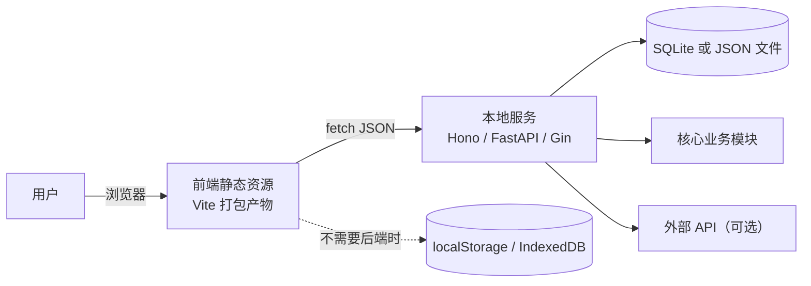

# 本地 Web UI 构建

浏览器是最普及的运行时。**只要用户接受"打开一个页面"而不是"双击一个图标"，Web UI 几乎总是性价比最高的选择**：没有签名、公证、更新器这三座大山，改完刷新即生效。

## 目录

- 三种架构形态
- 架构图
- 前端默认栈
- 后端与数据存储
- 数据不出本机的兑现方式
- 生命周期与工程细节
- 部署形态：本机、内网、公网
- 项目结构示例
- 超出轻量范围时
- 国内合规与加速
- PWA 取舍

## 三种架构形态

| 形态 | 组成 | 适合 | 代价 |
| --- | --- | --- | --- |
| 纯静态页面 | 一个 HTML/JS 包，无后端 | 数据就在本地文件或 `localStorage`；计算在浏览器里 | 无法读写任意磁盘路径、无法调用系统能力 |
| 本地小服务 + 页面 | 本机进程提供 HTTP API，浏览器访问 | 需要读文件、跑脚本、调本地数据库 | 要处理端口、进程生命周期 |
| 桌面壳 + 页面 | Tauri/Electron 装下同一个页面 | 需要窗口、托盘、离线双击 | 增加打包与签名成本 |

**决策顺序**：先试纯静态（成本最低）→ 不够再上本地小服务 → 需要窗口与托盘才上桌面壳。跳级是常见的过度设计。

## 架构图



图中的虚线表示**无后端路径**。如果业务能走这条路，就删掉整个后端，项目复杂度直接减半。前端到后端之间只传 JSON，不要让前端直接拼 SQL 或读文件路径——这是未来改成桌面壳或多人版本时唯一重要的边界。

## 前端默认栈

| 用途 | 默认选择 | 理由 |
| --- | --- | --- |
| 构建工具 | Vite | 启动快、配置少、生态默认 |
| 框架 | React 或 Svelte | 资料最多；Svelte 产物更小 |
| 样式 | Tailwind CSS v4 | 与组件库配合好，避免手写 CSS 漂移 |
| 组件库 | shadcn/ui 或 Radix + 自定义样式 | 源码进项目，可改可删，无黑盒依赖 |
| 路由 | 框架自带（React Router / SvelteKit） | 不引入额外抽象 |
| 表格 | TanStack Table | 排序、筛选、虚拟滚动开箱可用 |
| 图表 | ECharts（中文文档最好）或 Recharts | 本地化需求优先选 ECharts |
| 状态 | Zustand 或 Svelte store | 小工具不需要 Redux 级别复杂度 |

**刻意不引入**：GraphQL、微前端、服务端渲染框架（本地工具用不上 SEO）、复杂的状态管理库。每多一个抽象，非技术用户未来找人维护的成本就高一分。

## 后端与数据存储

| 语言 | 框架 | 特点 |
| --- | --- | --- |
| TypeScript | Hono 或 Fastify | 与前端同语言，类型可全链路共享 |
| Python | FastAPI | 自动生成交互式 API 文档，数据处理生态强 |
| Go | Gin 或 Echo | 可编译成单个二进制，部署最省事 |

数据存储按规模选：

- **配置和小状态**（几百条以内）：单个 JSON 文件 + 原子写入，人能直接打开看。
- **结构化记录**（几千到几十万条）：SQLite。单文件、零配置、可备份，是本地工具的事实标准。
- **大文件附件**：文件系统存原始文件，数据库里只存路径和元数据。

**单文件交付（Go 独门优势）**：用 `embed` 把整个前端 `dist/` 目录编译进可执行文件，最终交付物就是**一个文件**：

```go
//go:embed all:frontend/dist
var assets embed.FS

func main() {
    sub, _ := fs.Sub(assets, "frontend/dist")
    mux := http.NewServeMux()
    mux.Handle("/api/", apiRouter())                 // 接口
    mux.Handle("/", http.FileServer(http.FS(sub)))   // 界面
    log.Fatal(http.ListenAndServe("127.0.0.1:0", mux))
}
```

| 元素 | 含义 |
| --- | --- |
| `//go:embed all:frontend/dist` | 编译期把目录打进二进制；`all:` 连 `_` 和 `.` 开头的文件也包含 |
| `embed.FS` | 只读的嵌入式文件系统类型 |
| `fs.Sub(..., "frontend/dist")` | 把根切到该子目录，请求 `/index.html` 才能对上 |
| `127.0.0.1:0` | 只监听回环本机；端口 `0` 由系统分配空闲端口，取到实际端口后再开浏览器 |

## 数据不出本机的兑现方式

当用户说"数据不能离开我的电脑"，这必须变成可验证的技术约束，而不是一句口头承诺：

- **不引外部 CDN**：所有 JS、CSS、字体全部本地打包或放进 `public/`，页面在断网状态下必须完整可用。
- **不加载外部字体**：中文界面尤其要注意，Google Fonts 在国内既慢又有隐私问题，用系统字体栈（`PingFang SC`、`Microsoft YaHei`、`Noto Sans CJK SC`）。
- **内容安全策略**（Content-Security-Policy，CSP）明确设为只允许 `'self'`，从机制上禁止页面外联。
- **外部调用显式列出**：如果确实要调用某个在线 API，在界面上标注，并让用户可以关闭。
- **验证方法写进文档**：开启浏览器开发者工具的网络面板，执行一次完整操作，截图证明除本机地址外没有其他请求。

## 生命周期与工程细节

- **端口冲突**：先试固定端口（如 8787），被占用则回退到随机端口，把实际地址打印到终端；不要让用户看到 `EADDRINUSE` 就束手无策。
- **自动打开浏览器**：服务就绪后调用系统默认浏览器，同时提供 `--no-open` 供脚本场景使用：
- Windows：`rundll32 url.dll,FileProtocolHandler <url>` 或 `start`。
- macOS：`open <url>`。
- Linux：`xdg-open <url>`。
- 也可用现成库：Go 的 `pkg/browser`、Python 的 `webbrowser`、Node 的 `open`。
- **防端口抢占**：生成一次性 token 拼在 URL 上（如 `http://127.0.0.1:8787/?token=xxx`），接口校验 token 后才执行业务逻辑，防止本机其他程序或恶意网页调用接口。
- **优雅关闭**：捕获 Ctrl+C 和系统关机信号，先停接收新请求、再落盘状态、最后退出；Windows 上注意信号模型差异。
- **单实例**：用锁文件或端口探测防止起多个实例导致数据竞争。
- **升级体验**：前端资源带内容哈希文件名，避免更新后浏览器用旧缓存。
- **中文字体与排版**：`font-family` 中文字体放英文之后，行高略放大（1.6–1.7），否则中文密集时压迫感强。
- **键盘可达**：所有按钮可用 Tab 到达，表单支持回车提交。这类"看不见的正确"决定了工具像不像专业软件。

## 部署形态：本机、内网、公网

| 目标 | 做法 | 注意 |
| --- | --- | --- |
| 只在本机 | 本地服务绑定 `127.0.0.1` | 绝不要绑 `0.0.0.0`，否则局域网内任何人都能访问 |
| 团队内网共享 | 部署在一台内网机器，绑定内网地址，加简单的口令或 Token | 数据一致性和备份责任要明确到人 |
| 公网可用 | 用静态托管或带认证的服务端部署，全站 HTTPS | 一旦上公网，就要考虑账号体系、限流、备份，超出"轻量工具"范畴 |

**默认绑定 `127.0.0.1` 是一条安全红线**，无数本地工具因为顺手绑了 `0.0.0.0` 而把本机文件暴露给整个局域网。

## 项目结构示例

```text
my-tool/
├── src/                  # 前端源码（Vite + React/Svelte）
│   ├── pages/            # 页面组件
│   ├── components/       # 可复用组件
│   ├── lib/api.ts        # 唯一的后端访问出口
│   └── main.tsx
├── server/               # 本地服务（可缺省）
│   ├── index.ts          # 路由与启动
│   ├── core/             # 业务逻辑，不依赖 HTTP 框架
│   └── store/            # SQLite/JSON 访问层
├── public/               # 本地字体与静态资源（不外联）
├── scripts/              # dev.sh / dev.ps1 / install.sh / install.ps1
├── docs/                 # USAGE.md 与 DECISIONS.md
└── README.md
```

两条纪律：前端只通过 `lib/api.ts` 这一个文件访问后端，后端换实现时前端零改动；`server/core` 目录不出现任何 HTTP 概念，这让它未来可以直接被 CLI 复用，形成混合形态。

## 超出轻量范围时

只有分诊确认为"多人用 / 公网访问"才考虑以下事项，每项一行：

- **鉴权**：优先现成方案（Clerk、Auth.js、Supabase Auth、Casdoor 自建）；不自己写密码存储，必须用 Argon2/bcrypt。
- **数据库**：起步 SQLite（单机）→ PostgreSQL（多实例）；ORM 选 Prisma/Drizzle（Node）或 SQLModel/SQLAlchemy（Python）。
- **部署**：静态前端用 Cloudflare Pages / Vercel / GitHub Pages；全栈用一台 VPS + Docker Compose + Caddy（自动 HTTPS）。
- **备份**：数据库每日快照并异地保留，演练一次"从备份恢复"。

## 国内合规与加速

| 事项 | 说明 |
| --- | --- |
| ICP 备案 | 服务器在中国大陆境内且绑定域名对外提供服务，依法需要 ICP 备案；部署境外则无需备案，但境内访问速度与稳定性会明显下降 |
| 依赖镜像 | npm → `registry.npmmirror.com`；PyPI → 清华/阿里镜像；Go → `GOPROXY=https://goproxy.cn,direct`；Homebrew → 中科大/清华镜像 |
| GitHub 加速 | Release 下载可用镜像代理包裹原链接，镜像代理示例（引用前实测）：`https://gh-proxy.com/` + 原始 URL；生产环境不应依赖第三方镜像 |
| 代理配置 | `*nix` 下 `export HTTPS_PROXY=http://127.0.0.1:7890`；Windows PowerShell 下 `$env:HTTPS_PROXY="http://127.0.0.1:7890"`；端口按本地代理软件实际监听值填写 |

## PWA 取舍

| 情况 | 结论 |
| --- | --- |
| 需离线可用、可"安装"到桌面/主屏，或要桌面推送通知 | 值得（iOS 推送支持受限） |
| 需访问本地文件系统、系统托盘、开机自启 | 不值得，PWA 做不到，走桌面壳 |
| 只是想让网页加载快一点 | 不必大动干戈，加个 Service Worker 缓存即可 |

三件套：`manifest.webmanifest`（名称、图标、主题色、`display: standalone`）+ Service Worker（缓存策略）+ HTTPS。
