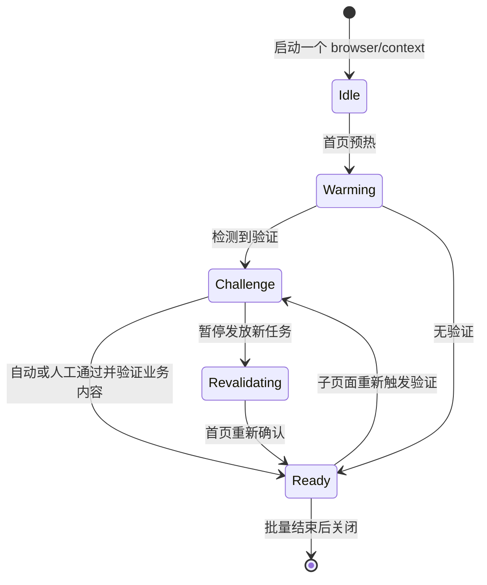

# 批量、并发与 Sitemap

## 必须遵循的顺序

1. 按站点 origin、代理出口和浏览器身份对 URL 分组。
2. 只创建一个浏览器会话，先单路访问站点首页。默认使用状态码、挑战特征、正文大小和最终 origin 做基础确认；只有用户要求严格检查时才增加固定标题、选择器、业务文本或路径断言。
3. 设置一个预热屏障：只有首页验证成功后，才创建其他 tab 或启动并发任务。预热失败时不要放开并发。
4. 请求 sitemap 时，按“首页 → sitemap index → 子 sitemap → 详情页”的顺序执行。不要把 `/sitemap.xml` 作为新会话的首个验证页面。
5. 后续请求继续使用相同 browser/context、代理、locale、timezone 和 User-Agent。`SiteSessionManager` 先执行不带求解等待的轻量子页面导航；若返回内容出现挑战特征，再暂停新任务、重新预热并以 `solve_cloudflare=True` 重试该页。
6. 任务完成后再关闭整个会话，不要为每个 URL 创建并销毁浏览器。并发数应小于等于 `max_pages`，并按站点容量设置较小上限。

Cloudflare cookie 可能与域名、出口 IP 和浏览器指纹绑定。跨 origin 或跨子域不保证共享验证成果；必要时为每个需要独立验证的 origin 分别预热。

## Scrapling 会话模式

使用 `site_session.SiteSessionManager` 维持一个 `AsyncStealthySession`、一个浏览器上下文和受限数量的 tab。管理器提供 single-flight 预热、同源检查、挑战页检测、结构化内容验证、五分钟硬超时和重验证屏障。



下面的 Python API 不写文件，返回顺序与输入顺序一致：

```python
from site_session import SiteRequest, SiteSessionManager, SiteSessionOptions


async def fetch_batch(home_url: str, urls: list[str], proxy: str) -> list[str]:
    options = SiteSessionOptions(
        home_url=home_url,
        proxy=proxy,
        headless=False,
        max_pages=4,
        concurrency=3,
        timeout_ms=300_000,
        wall_timeout_ms=330_000,
    )
    async with SiteSessionManager(options) as site:
        await site.warmup()
        results = await site.fetch_many([SiteRequest(url) for url in urls])
        return [result.html for result in results]
```

`SiteSessionManager.fetch()` 和 `fetch_many()` 会自动确保预热，但生产调用应显式调用 `warmup()`，让失败发生在创建批量任务之前。访问 sitemap 时先完成 `await site.warmup()`，再请求 sitemap；解析得到详情 URL 后才启动受限并发。

管理器只允许与 `home_url` 同源的 URL，防止把同一浏览器身份和会话状态意外带到其他站点。跨 origin 或需要不同代理时创建独立管理器。

## 人工首次验证

设置 `headless=False` 后，Scrapling 的自动求解与可见窗口同时工作。检测到挑战时，管理器清除就绪事件并通过 `on_challenge(ChallengeEvent)` 通知调用者；用户在这个窗口中完成验证，Scrapling 返回业务页面后才开放并发。不要调用 `input()` 阻塞事件循环，也不要等待用户手动声明完成；以页面状态和业务字段为准。

不要先在 CloakBrowser 默认 context 中人工验证，再假定 `AsyncStealthySession(cdp_url=...)` 会复用它。Scrapling 0.4.11 的 CDP 会话会创建新的 context。必须精确保留 CloakBrowser context 时，继续用该 Playwright context 导航，只把 `page.content()` 交给 Scrapling `Selector` 解析。

`SiteSessionManager` 在同一运行内复用浏览器最完整的活动状态。`storage_state` 或 cookie 导出只适合辅助恢复，不等价于原 context，不能保证 Cloudflare clearance 继续有效。

## Profile 选择

- 全新试验或连续单次批量：不设置 `profile_dir`。管理器显式创建空的临时 profile，多个 tab 共用该 context，关闭浏览器后清理目录。
- 跨进程、跨重启或需要保留人工验证：使用专用 `--profile-dir`。不要让多个进程同时打开同一目录。
- 磁盘管理：profile 会积累缓存、Service Worker、IndexedDB、Local Storage 和 cookie，可能明显增长。记录目录位置和大小；只在浏览器完全关闭且确认不再需要会话成果后清理。
- 多 worker：不要把“每个 worker 一个新浏览器”当作 tab 并发。它会重复验证、增加内存和磁盘开销，并可能因短时间产生多个新身份而提高拦截概率。

## GreenTradingXXL 示例

运行 `scripts/example_greentradingxxl_batch.py`。脚本先访问首页，允许在可见窗口完成人工验证，然后复用同一 context 抓取三个指定商品页，将渲染后 HTML 和 `summary.json` 写入输出目录。默认使用全新临时 profile 和宽松检查；只有明确需要业务断言时添加 `--strict`。默认探测本地 `7897`、`7890` 和 `10808`，代理不可用时不会静默直连。
