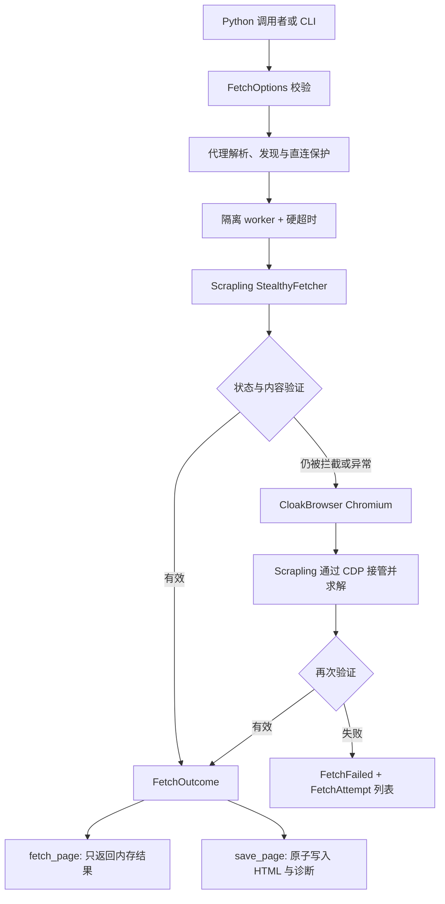

# Python 模块设计与 API

将 `<skill-dir>/scripts` 加入 `PYTHONPATH` 或 `sys.path` 后，按任务类型导入 `resilient_fetch` 或 `site_session`。导入模块不会启动浏览器、修改日志配置或写文件。

## 模块定位

`resilient_fetch` 不是新的 Cloudflare 求解器。实际挑战识别与交互仍由 Scrapling 完成，CloakBrowser 只提供可选的 Chromium 指纹底座。本模块的意义是把容易遗漏且跨项目重复出现的可靠性措施组合成一个明确契约。

| 能力 | 直接调用 Scrapling | `resilient_fetch` |
| --- | --- | --- |
| Cloudflare 求解算法 | Scrapling 原生实现 | 仍使用 Scrapling，不声称更强 |
| 浏览器生命周期 | 调用者管理 | 每个引擎在隔离子进程中运行，并有硬超时和进程树回收 |
| 失败回退 | 调用者编排 | `Scrapling → CloakBrowser CDP` 顺序回退 |
| 代理安全 | 调用者处理 | 代理预检、本地端口发现、默认禁止静默直连、凭据遮蔽 |
| 成功判断 | 通常由调用者判断 | 同时检查 HTTP 状态、挑战特征、最小字节数和业务文本 |
| 结果模型 | Scrapling `Response` | 统一为 `FetchResult`、`FetchAttempt` 和 `FetchOutcome` |
| 文件输出 | 调用者实现 | 可选原子写入、SHA-256、元数据、失败 HTML 和尝试记录 |
| 批量共享会话 | 调用者自行实现状态协调 | `site_session` 提供预热、人工接管通知、就绪屏障、同源限制和重验证 |

因此，`resilient_fetch` 适合一次性页面任务、作业队列中的独立任务、未知站点诊断和需要可预测失败边界的服务。连续批量、首页预热、人工首次验证和多 tab 复用使用 `site_session`。需要自定义复杂 `page_action` 或直接操作 Playwright `Page` 时才绕过管理器调用 Scrapling 原生 session。

## 组件与数据流



关键边界：

- worker 隔离防止浏览器启动、挑战循环或关闭阶段拖死调用进程。
- `wall_timeout_ms` 是调用者可预测的硬上限，不等同于 Scrapling 的页面操作超时。
- 回退引擎返回 HTTP `200` 也必须经过内容验证，避免把挑战页当成业务页面。
- `fetch_page()` 不写业务文件；`save_page()` 才拥有文件副作用。

## 获取页面但不写文件

```python
from resilient_fetch import FetchFailed, FetchOptions, fetch_page

options = FetchOptions(
    url="https://example.com/",
    discover_proxy=True,
    timeout_ms=300_000,
    wall_timeout_ms=600_000,
    expected_texts=("Example Domain",),
)

try:
    outcome = fetch_page(options)
except FetchFailed as exc:
    for attempt in exc.attempts:
        print(attempt.engine, attempt.error, attempt.reasons)
    raise

print(outcome.result.status)
print(outcome.result.title)
print(outcome.result.html)
print([attempt.as_metadata() for attempt in outcome.attempts])
```

`fetch_page()` 返回 `FetchOutcome`，不会写 HTML、元数据或诊断文件：

- `outcome.result`：`FetchResult`，包含 `html`、`title`、`status`、`final_url`、`engine`、耗时和版本。
- `outcome.attempts`：每个引擎的 `FetchAttempt`；被拒绝页面保存在 `rejected_html`，便于调用者自行诊断。
- `outcome.proxy`：最终使用的代理，可能因显式允许直连而为 `None`。

## 获取并保存

```python
from resilient_fetch import FetchOptions, save_page

outcome = save_page(
    FetchOptions(url="https://example.com/", proxy="http://127.0.0.1:7897"),
    "./example.html",
)
```

`save_page()` 复用同一获取 API，并原子写入 HTML、`.meta.json`、失败尝试记录和拦截诊断页。成功时仍返回 `FetchOutcome`。

## 异常与日志

- `ValueError`：URL、超时、引擎或数值选项无效。
- `ProxyUnavailableError`：显式代理或本地代理发现失败，且未允许直连。
- `FetchFailed`：所有引擎都异常或返回了无效内容；通过 `attempts` 检查结构化原因。

模块不调用 `logging.basicConfig()`。库调用者自行配置日志；只有 CLI 和示例脚本配置默认日志格式。

## 生命周期边界

`fetch_page()` 为单页可靠性使用隔离子进程，并可能按顺序启动 Scrapling 与 CloakBrowser。它适合单次调用、作业队列中的独立任务和故障隔离，不适合在连续批量任务中对很多 URL 直接并发调用，否则会创建多个浏览器并重复验证。

连续批量或 sitemap 任务使用 [batch-workflows.md](batch-workflows.md) 中的 `SiteSessionManager`：先首页预热，再复用一个 browser/context 和多个 tab。

## 长期站点会话

`site_session` 的主要类型：

- `SiteSessionOptions`：绑定首页、代理、profile、并发、超时和浏览器身份。
- `SiteRequest`：描述一个同源 URL。默认只使用状态码、挑战特征、最小正文大小和最终 origin 做基础检查；`expected_texts`、`expected_selector`、`wait_selector`、`case_sensitive=True` 和 `require_same_path=True` 都是调用者显式启用的严格条件。
- `SiteSessionManager`：异步上下文管理器；提供 `warmup()`、`fetch()` 和 `fetch_many()`。
- `ChallengeEvent`：挑战监视器通知；有头模式下调用者提醒用户操作同一个窗口。
- `WarmupError`、`PageRejectedError`、`PageTimeoutError`：保留请求、渲染结果或失败原因的结构化异常。

```python
from site_session import SiteRequest, SiteSessionManager, SiteSessionOptions

options = SiteSessionOptions(
    home_url="https://example.com/",
    proxy="http://127.0.0.1:7897",
    headless=False,
    max_pages=3,
    concurrency=2,
    timeout_ms=300_000,
    wall_timeout_ms=330_000,
)

async with SiteSessionManager(options) as site:
    await site.warmup()
    results = await site.fetch_many(
        [SiteRequest(url) for url in product_urls]
    )
```

上例每次启动都创建全新临时 profile，浏览器关闭后由管理器清理。需要严格检查时显式写出条件：

```python
request = SiteRequest(
    product_url,
    expected_texts=("Expected product",),
    expected_selector="h1.product_title",
    require_same_path=True,
)
```

只有跨重启复用合法会话时才设置 `profile_dir="./profiles/example"`。这会保留 cookie、Local Storage、Service Worker 和 HTTP cache，目录不会由管理器删除。

`fetch_many()` 在创建子任务前先等待首页预热，并通过内部 semaphore 将实际导航数限制到 `concurrency`。预热后的子页面先轻量导航；仅在内容检测到新挑战时才重新预热并启用求解重试。同一时间出现多个挑战时，只有一个重验证任务重新预热首页，其余调用者等待同一个就绪事件。
